# Mastering System Design: Complete Interview-Focused Knowledge Base

> **Course**: Mastering System Design: From Basics to Cracking Interviews  
> **Target**: DevOps/SRE Engineers & Cloud Architects  
> **Focus**: Interview Preparation + Real-World Application

---

## 📚 **COURSE ROADMAP**

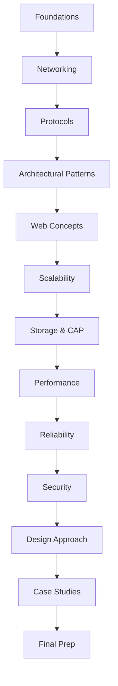

---

## 🎯 **90-DAY STUDY PLAN**

### **Phase 1: Foundations (Days 1-10)**
- Days 1-2: Course Foundations & Networking Basics
- Days 3-4: Protocols Deep Dive
- Days 5-6: Architectural Patterns
- Days 7-8: Web Concepts
- Days 9-10: Networking & Protocols Review

### **Phase 2: Core Concepts (Days 11-30)**
- Days 11-15: Scalability & Load Balancing
- Days 16-20: Storage, Databases & CAP Theorem
- Days 21-25: Performance & Caching
- Days 26-30: Reliability & High Availability

### **Phase 3: Advanced Topics (Days 31-50)**
- Days 31-35: Security & Authentication
- Days 36-40: System Design Approach
- Days 41-45: Case Studies 1-3 (URL Shortener, Ticketing, News Feed)
- Days 46-50: Case Studies 4-6 (Notification, Chat, Auction)

### **Phase 4: Complex Systems (Days 51-70)**
- Days 51-55: Case Studies 7-9 (Rental, Cloud Storage, Video)
- Days 56-60: Case Studies 10-12 (Search, E-commerce, Taxi)
- Days 61-65: Case Studies 13-14 (Document Editor, Advanced Topics)
- Days 66-70: Integration & Cross-Topic Connections

### **Phase 5: Interview Prep (Days 71-90)**
- Days 71-75: Top 50 Interview Questions
- Days 76-80: Mock Interviews & Whiteboard Practice
- Days 81-85: Pattern Recognition & Quick Answers
- Days 86-90: Final Review & Confidence Building

---

# SECTION 1: FOUNDATIONS

## 🚀 **What is System Design?**

### **Definition**
System Design is the process of defining the architecture, components, modules, interfaces, and data for a system to satisfy specified requirements.

### **Why It Matters**
- **Interview Success**: Top companies test system design rigorously
- **Career Growth**: Critical for senior/lead positions
- **Real Impact**: Directly affects system performance, scalability, and reliability

### **Interview Answer in 30 Seconds**
"System Design is about creating scalable, reliable, and maintainable software architectures that can handle real-world loads while meeting business requirements. It involves making trade-offs between different technical approaches based on constraints like scalability, performance, and cost."

### **SRE/Production Relevance**
- **Observability**: Design systems that can be monitored effectively
- **Incident Response**: Architecture should facilitate quick debugging
- **Capacity Planning**: Design for predictable scaling patterns

---

## 📈 **Evolution of System Design (25 Years)**

| Era | Focus | Key Technologies | SRE Impact |
|-----|-------|------------------|------------|
| 1990s | Monolithic | Mainframes, Client-Server | Simple monitoring |
| 2000s | Web Apps | LAMP Stack, Load Balancers | Basic uptime metrics |
| 2010s | Cloud & Microservices | AWS, Docker, Kubernetes | Complex observability |
| 2020s | AI/Edge Computing | Serverless, Edge, MLops | Auto-scaling, AIOps |

### **Key Evolution Points**
- **From Monolith to Microservices**: Increased complexity but better scalability
- **From On-Prem to Cloud**: Shift from capital to operational expenditure
- **From Manual to Automated**: Infrastructure as Code, GitOps

---

## 🎯 **Course Navigation Strategy**

### **Effective Learning Approach**
1. **Theory First**: Understand concepts before implementations
2. **Connect Topics**: Link related concepts across modules
3. **Practice Daily**: Apply concepts to real problems
4. **Mock Interviews**: Regular practice sessions

### **Common Mistakes to Avoid**
- ❌ Memorizing without understanding
- ❌ Skipping fundamentals for advanced topics
- ❌ Not practicing whiteboard problems
- ❌ Ignoring non-functional requirements

---

# SECTION 2: NETWORKING IN SYSTEM DESIGN

## 🌐 **Introduction to Networking in System Design**

### **Why Networking Matters**
- **Foundation**: All distributed systems rely on networking
- **Performance**: Network latency often dominates system performance
- **Reliability**: Network failures are common failure modes

### **SRE/Production Relevance**
- **Latency Monitoring**: Network delays affect user experience
- **Bandwidth Planning**: Capacity planning for network resources
- **Redundancy**: Multiple network paths for high availability

---

## 🏠 **Understanding IP Addresses**

### **Key Concepts**
- **IPv4 vs IPv6**: Address space exhaustion and transition
- **Public vs Private**: NAT and internal networking
- **Static vs Dynamic**: DHCP and address management

### **Interview Answer in 30 Seconds**
"IP addresses are unique identifiers for devices on networks. IPv4 provides 2^32 addresses while IPv6 provides 2^128. In system design, we use private IP ranges internally and public IPs for external access, with NAT handling the translation."

### **Real-World Example**
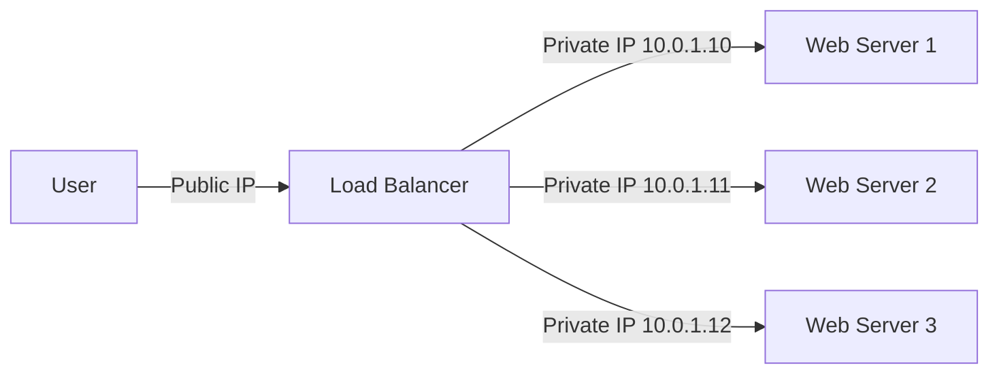

### **Common Mistakes**
- ❌ Not planning for IP address exhaustion
- ❌ Ignoring NAT implications for logging/monitoring
- ❌ Hardcoding IP addresses in configuration

---

## 🔍 **How DNS Works**

### **DNS Resolution Process**
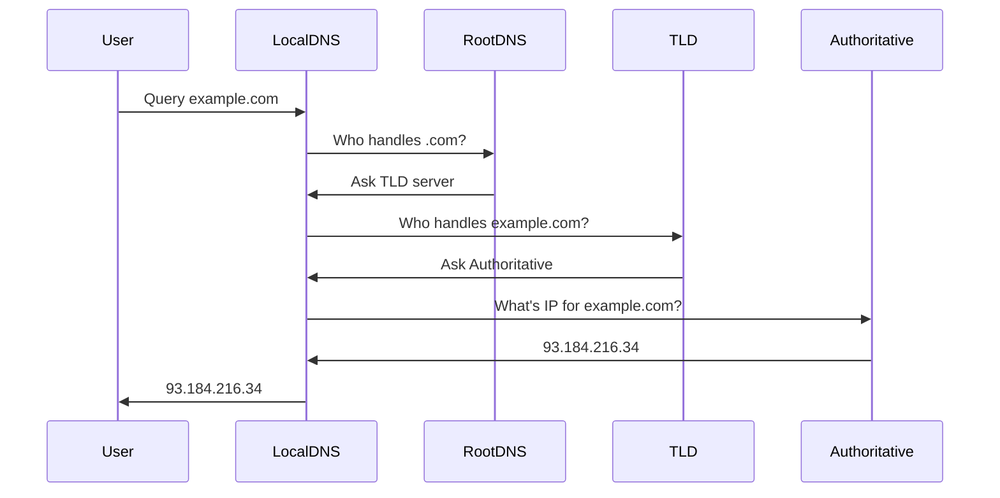

### **Key DNS Records**
| Record Type | Purpose | Example |
|-------------|---------|---------|
| A | IPv4 Address | example.com → 93.184.216.34 |
| AAAA | IPv6 Address | example.com → 2606:2800:220:1:248:1893:25c8:1946 |
| CNAME | Alias | www.example.com → example.com |
| MX | Mail Server | example.com → mail.example.com |
| TXT | Text | SPF, DKIM, verification |

### **Why This Matters in Real Systems**
- **Performance**: DNS lookup latency affects initial connection
- **Reliability**: DNS failures cause complete service outages
- **Security**: DNS spoofing, cache poisoning attacks

### **SRE/Production Relevance**
- **TTL Management**: Balance between cache hits and update speed
- **DNS Monitoring**: Track resolution times and failures
- **Failover**: DNS-based load balancing and failover strategies

### **Interview Answer in 30 Seconds**
"DNS translates domain names to IP addresses through a hierarchical system of servers. When a user requests a domain, the browser queries DNS recursively from root servers to authoritative name servers. Caching at multiple levels improves performance."

---

## 🖥️ **Client-Server Model Explained**

### **Architecture Overview**
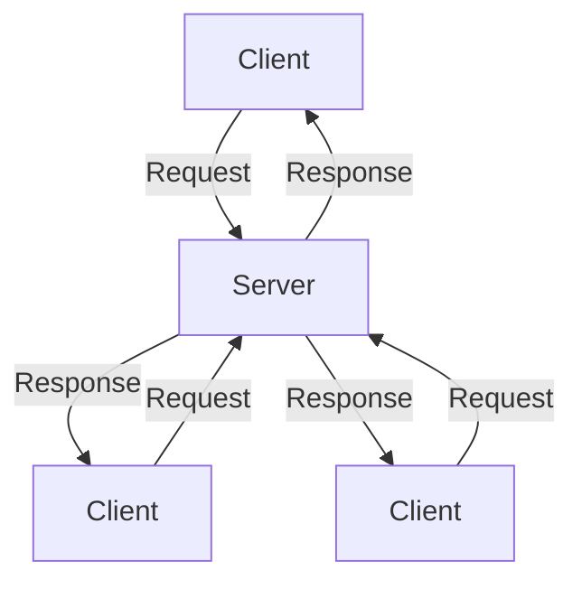

### **Key Characteristics**
- **Stateless**: Each request independent (HTTP)
- **Request-Response**: Client initiates, server responds
- **Scalable**: Multiple clients can connect simultaneously

### **Why This Matters in Real Systems**
- **Simplicity**: Easy to understand and implement
- **Scalability**: Horizontal scaling with load balancers
- **Maintenance**: Clear separation of concerns

### **Common Mistakes**
- ❌ Making clients stateful when they should be stateless
- ❌ Not handling concurrent requests properly
- ❌ Ignoring connection limits and timeouts

### **SRE/Production Relevance**
- **Connection Pooling**: Manage database connections efficiently
- **Timeout Management**: Prevent resource leaks
- **Load Balancing**: Distribute requests across servers

---

## 🛡️ **Forward Proxy vs Reverse Proxy**

### **Forward Proxy**


**Purpose**: Client-side proxy for internet access
- **Use Cases**: Corporate internet access, content filtering
- **Benefits**: Caching, security, anonymity
- **SRE Impact**: Monitor outbound traffic, security policies

### **Reverse Proxy**


**Purpose**: Server-side proxy for backend services
- **Use Cases**: Load balancing, SSL termination, caching
- **Benefits**: Scalability, security, performance
- **SRE Impact**: Central point for monitoring, SSL management

### **Comparison Table**
| Feature | Forward Proxy | Reverse Proxy |
|---------|---------------|--------------|
| Direction | Client → Internet | Internet → Server |
| Purpose | Client protection | Server protection |
| Location | Client network | Server network |
| Benefits | Caching, filtering | Load balancing, SSL |
| SRE Focus | Outbound traffic | Inbound traffic |

### **Interview Answer in 30 Seconds**
"Forward proxy sits in front of clients, managing their internet requests, while reverse proxy sits in front of servers, distributing incoming requests. Forward proxy is for client protection, reverse proxy is for server protection and load balancing."

---

## ⚖️ **Introduction to Load Balancing**

### **Load Balancer Types**
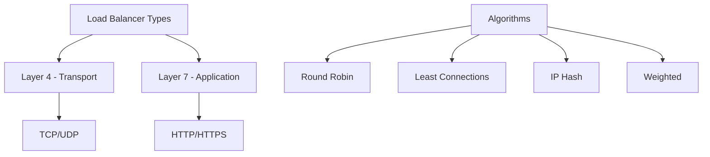

### **Common Algorithms**
| Algorithm | How It Works | Best For |
|-----------|--------------|----------|
| Round Robin | Sequential rotation | Equal server capacity |
| Least Connections | Server with fewest active connections | Variable request duration |
| IP Hash | Client IP determines server | Session persistence |
| Weighted | Capacity-weighted distribution | Unequal server sizes |

### **Why This Matters in Real Systems**
- **Scalability**: Distribute load across multiple servers
- **Reliability**: Remove failed servers automatically
- **Performance**: Optimize resource utilization

### **SRE/Production Relevance**
- **Health Checks**: Monitor server availability
- **Session Persistence**: Maintain user sessions
- **Auto-scaling Integration**: Add/remove servers dynamically

### **Interview Answer in 30 Seconds**
"Load balancing distributes incoming requests across multiple servers to improve reliability and performance. Common algorithms include round robin for equal distribution and least connections for varying request loads. Health checks ensure failed servers are removed from rotation."

---

## 🚪 **What is an API Gateway?**

### **Architecture Overview**
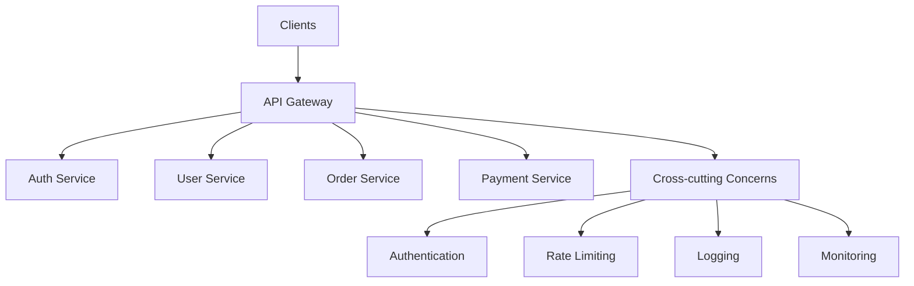

### **Key Responsibilities**
- **Request Routing**: Direct to appropriate microservice
- **Authentication**: Validate tokens, API keys
- **Rate Limiting**: Prevent abuse
- **Load Balancing**: Distribute requests
- **Caching**: Improve performance
- **Monitoring**: Log and track requests

### **Why This Matters in Real Systems**
- **Microservices**: Single entry point for distributed systems
- **Security**: Centralized authentication and authorization
- **Performance**: Caching and request optimization

### **Common Mistakes**
- ❌ Making API gateway a bottleneck
- ❌ Not implementing proper rate limiting
- ❌ Ignoring monitoring and logging
- ❌ Single point of failure without redundancy

### **SRE/Production Relevance**
- **Observability**: Central point for monitoring all services
- **Circuit Breakers**: Prevent cascade failures
- **Rate Limiting**: Protect backend services
- **Deployment**: Blue-green, canary deployments

---

## 🌍 **Content Delivery Networks (CDN)**

### **CDN Architecture**
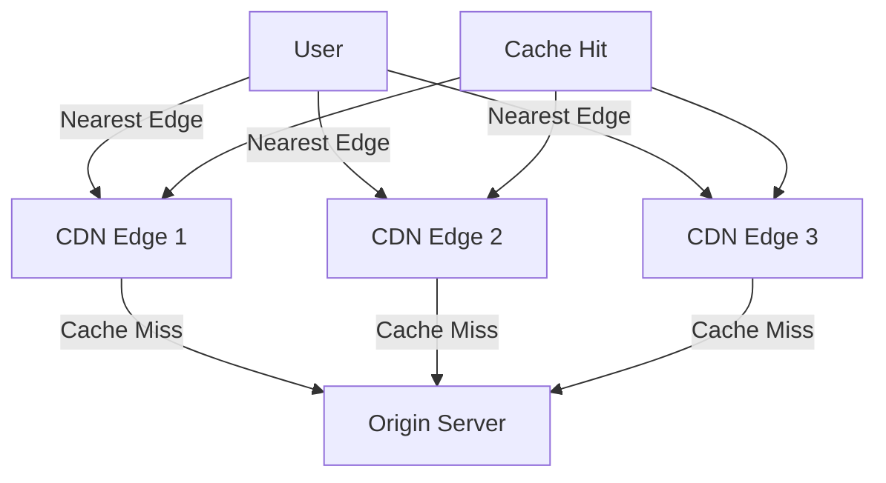

### **Key Benefits**
- **Performance**: Reduced latency through geographic distribution
- **Scalability**: Handle traffic spikes efficiently
- **Reliability**: Redundant edge locations
- **Cost**: Reduced bandwidth costs

### **Caching Strategies**
| Strategy | Description | Use Case |
|----------|-------------|---------|
| Cache-Control | HTTP caching headers | Static assets |
| Edge Caching | Cache at CDN edges | Popular content |
| Regional Caching | Regional cache servers | Geographic distribution |
| Dynamic Caching | Cache dynamic content | Personalized content |

### **Why This Matters in Real Systems**
- **Global Performance**: Faster content delivery worldwide
- **Bandwidth Savings**: Reduced origin server load
- **Reliability**: Content available even if origin fails

### **SRE/Production Relevance**
- **Cache Invalidation**: Update content across all edges
- **Performance Monitoring**: Track CDN hit ratios
- **Failover**: Origin server fallback strategies

### **Interview Answer in 30 Seconds**
"CDN is a distributed network of servers that delivers content based on user location. It caches content at edge locations to reduce latency and improve performance. CDN handles traffic spikes, reduces origin load, and provides global content delivery with built-in redundancy."

---

## 📋 **Networking Fundamentals Summary**

### **Key Takeaways**
1. **DNS**: Domain resolution hierarchy and caching
2. **Client-Server**: Request-response architecture
3. **Proxies**: Forward (client) vs Reverse (server)
4. **Load Balancing**: Distribution algorithms and health checks
5. **API Gateway**: Microservices entry point
6. **CDN**: Geographic content distribution

### **Cross-Topic Connections**
- **Load Balancer** ↔ **Scalability** ↔ **Availability**
- **CDN** ↔ **Performance** ↔ **Caching**
- **API Gateway** ↔ **Security** ↔ **Microservices**
- **DNS** ↔ **Reliability** ↔ **Failover**

### **Common Interview Questions**
1. How does DNS resolution work?
2. What's the difference between forward and reverse proxy?
3. Load balancing algorithms and when to use each?
4. Why use an API gateway in microservices?
5. How does CDN improve performance?

---

# SECTION 3: PROTOCOLS

## 🔌 **TCP & UDP**

### **Comparison Table**
| Feature | TCP | UDP |
|---------|-----|-----|
| Reliability | Reliable, ordered delivery | Unreliable, no guarantee |
| Speed | Slower (overhead) | Faster (minimal overhead) |
| Flow Control | Yes (sliding window) | No |
| Error Checking | Yes | Yes (basic) |
| Use Cases | Web, email, file transfer | Streaming, gaming, VoIP |

### **TCP Three-Way Handshake**
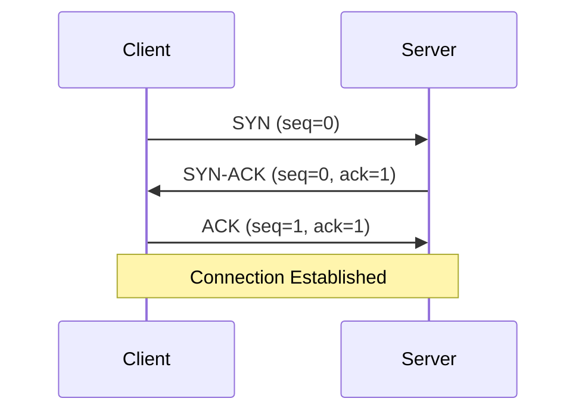

### **Why This Matters in Real Systems**
- **TCP**: When reliability matters (HTTP, database connections)
- **UDP**: When speed matters (streaming, real-time gaming)
- **Performance**: Protocol choice affects latency and throughput

### **SRE/Production Relevance**
- **Connection Limits**: TCP connection pooling
- **Timeout Management**: Handle connection failures
- **Protocol Monitoring**: Track TCP vs UDP traffic patterns

### **Interview Answer in 30 Seconds**
"TCP provides reliable, ordered delivery with flow control, making it ideal for web traffic and file transfers. UDP is faster but unreliable, perfect for streaming and real-time applications where speed is more important than reliability."

---

## 🌐 **HTTP - The Backbone of the Web**

### **HTTP/1.1 vs HTTP/2 vs HTTP/3**
| Version | Key Features | Performance | SRE Impact |
|---------|--------------|-------------|------------|
| HTTP/1.1 | Text-based, persistent connections | Baseline | Simple debugging |
| HTTP/2 | Binary, multiplexing, header compression | 2x faster | Complex monitoring |
| HTTP/3 | QUIC transport, 0-RTT | 3x faster | UDP monitoring |

### **HTTP Methods**
| Method | Safe | Idempotent | Use Case |
|--------|------|------------|---------|
| GET | ✅ | ✅ | Retrieve data |
| POST | ❌ | ❌ | Create resource |
| PUT | ❌ | ✅ | Update/replace |
| DELETE | ❌ | ✅ | Remove resource |
| PATCH | ❌ | ❌ | Partial update |

### **Status Codes**
- **2xx**: Success (200 OK, 201 Created)
- **3xx**: Redirection (301 Moved, 302 Found)
- **4xx**: Client Error (400 Bad, 404 Not Found)
- **5xx**: Server Error (500 Error, 503 Unavailable)

### **Why This Matters in Real Systems**
- **Performance**: HTTP version affects latency
- **Reliability**: Proper status code handling
- **Security**: HTTPS, headers, CORS

### **SRE/Production Relevance**
- **Status Code Monitoring**: Track 4xx/5xx errors
- **Performance Metrics**: Response times, throughput
- **SSL/TLS Management**: Certificate monitoring

### **Interview Answer in 30 Seconds**
"HTTP is the foundation of web communication, evolving from text-based HTTP/1.1 to binary HTTP/2 with multiplexing, and HTTP/3 with QUIC transport. Understanding methods, status codes, and versions is crucial for building performant web applications."

---

## 🔄 **REST & RESTfulness - API Design Principles**

### **REST Constraints**
1. **Client-Server**: Separation of concerns
2. **Stateless**: No client context stored on server
3. **Cacheable**: Responses must define cacheability
4. **Uniform Interface**: Standard methods, resources
5. **Layered System**: Intermediate layers
6. **Code-on-Demand**: Optional (server sends code)

### **RESTful API Design**
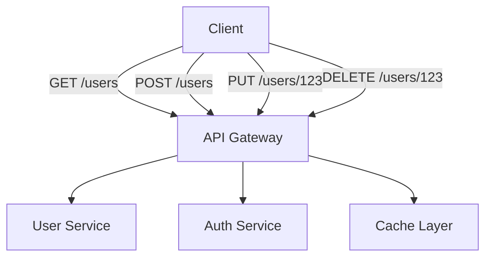

### **Best Practices**
- **Resource Naming**: Use nouns, not verbs (/users, not /getUsers)
- **HTTP Methods**: Use appropriate methods (GET, POST, PUT, DELETE)
- **Status Codes**: Return proper HTTP status codes
- **Versioning**: API versioning strategy (/v1/users)
- **Pagination**: Limit response sizes

### **Common Mistakes**
- ❌ Using verbs in endpoints (/getUser vs /users)
- ❌ Not using proper HTTP methods
- ❌ Ignoring status codes
- ❌ No pagination for large datasets
- ❌ Not implementing caching

### **Why This Matters in Real Systems**
- **Scalability**: Stateless design enables horizontal scaling
- **Maintainability**: Standard patterns easier to understand
- **Performance**: Caching and CDN integration

### **Interview Answer in 30 Seconds**
"REST is an architectural style using HTTP methods to operate on resources. Key principles include statelessness, cacheability, and uniform interface. RESTful APIs use nouns for resources, proper HTTP methods, and appropriate status codes for scalable, maintainable systems."

---

## ⚡ **Real-Time Communication Protocols**

### **WebSocket vs Server-Sent Events vs WebRTC**
| Protocol | Pattern | Use Case | SRE Impact |
|----------|---------|----------|------------|
| WebSocket | Bidirectional | Chat, live updates | Connection management |
| SSE | Server to client | Notifications, feeds | Simple scaling |
| WebRTC | Peer-to-peer | Video/audio calls | NAT traversal |

### **WebSocket Architecture**
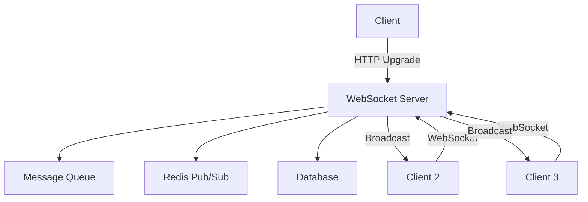

### **Why This Matters in Real Systems**
- **Real-Time Requirements**: Chat, notifications, live updates
- **Performance**: Low latency communication
- **Scalability**: Connection management challenges

### **SRE/Production Relevance**
- **Connection Monitoring**: Track active connections
- **Message Queue**: Handle backpressure and failures
- **Scaling**: Horizontal scaling of WebSocket servers

### **Interview Answer in 30 Seconds**
"Real-time communication uses WebSocket for bidirectional communication, SSE for server-to-client updates, and WebRTC for peer-to-peer connections. WebSocket maintains persistent connections for low-latency messaging, ideal for chat and live applications."

---

## 🚀 **Modern API Protocols - Beyond REST**

### **GraphQL vs REST vs gRPC**
| Protocol | Style | Performance | Use Case |
|----------|-------|-------------|----------|
| REST | HTTP/JSON | Good | General purpose |
| GraphQL | HTTP/JSON | Variable | Flexible queries |
| gRPC | HTTP/2/Protobuf | Excellent | Microservices |

### **GraphQL Benefits**
- **Single Endpoint**: One URL for all queries
- **Flexible Queries**: Request only needed data
- **Strong Typing**: Schema validation
- **Real-time**: Subscriptions support

### **gRPC Benefits**
- **Performance**: HTTP/2 + Protobuf
- **Type Safety**: Strongly typed interfaces
- **Streaming**: Bidirectional streaming
- **Code Generation**: Auto client/server code

### **Why This Matters in Real Systems**
- **Performance**: Protocol choice affects latency
- **Developer Experience**: Tooling and documentation
- **Ecosystem**: Community support and libraries

### **Interview Answer in 30 Seconds**
"Modern protocols like GraphQL offer flexible queries with single endpoints, while gRPC provides high-performance binary communication with code generation. The choice depends on performance requirements, team expertise, and ecosystem needs."

---

## 📋 **Protocols Summary**

### **Key Takeaways**
1. **TCP vs UDP**: Reliability vs speed trade-off
2. **HTTP Evolution**: Performance improvements with each version
3. **REST Principles**: Stateful vs stateless design
4. **Real-Time**: WebSocket for bidirectional communication
5. **Modern APIs**: GraphQL and gRPC for specific use cases

### **Cross-Topic Connections**
- **HTTP** ↔ **API Gateway** ↔ **Microservices**
- **WebSocket** ↔ **Real-Time** ↔ **Scalability**
- **gRPC** ↔ **Microservices** ↔ **Performance**
- **TCP/UDP** ↔ **Networking** ↔ **Reliability**

---

# SECTION 4: ARCHITECTURAL PATTERNS

## 🏗️ **Software Architecture Patterns & Styles**

### **Monolithic vs Microservices**
| Aspect | Monolithic | Microservices |
|--------|------------|---------------|
| Deployment | Single unit | Independent |
| Scaling | Vertical | Horizontal |
| Complexity | Low (initially) | High |
| Team Size | Small | Large |
| Failure Impact | System-wide | Service-local |

### **Architectural Patterns Evolution**
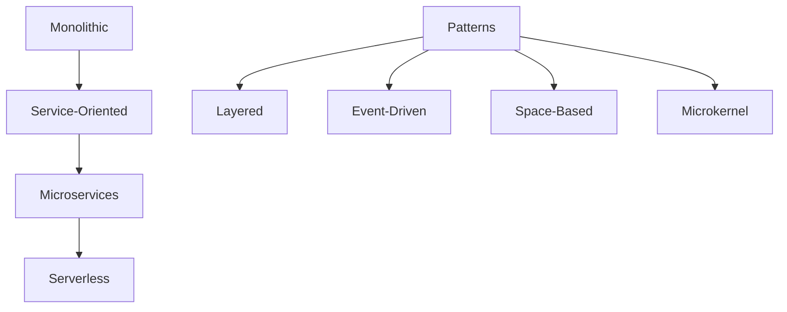

### **Why This Matters in Real Systems**
- **Scalability**: Pattern affects scaling strategy
- **Team Organization**: Conway's Law
- **Maintenance**: Complexity and debugging challenges

### **SRE/Production Relevance**
- **Monitoring**: Service-level vs system-level monitoring
- **Deployment**: Blue-green, canary strategies
- **Incident Response**: Isolating failures

---

## 🏢 **Multi-Tier Architecture**

### **Three-Tier Architecture**
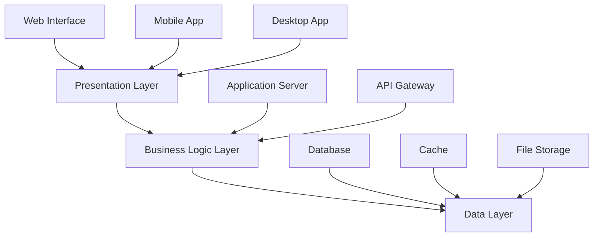

### **Layer Responsibilities**
| Layer | Responsibility | Technologies |
|-------|----------------|---------------|
| Presentation | UI/UX, user interaction | React, Angular, Vue |
| Business | Application logic, rules | Node.js, Python, Java |
| Data | Storage, persistence | PostgreSQL, MongoDB, Redis |

### **Why This Matters in Real Systems**
- **Separation of Concerns**: Clear boundaries
- **Scalability**: Independent scaling of layers
- **Maintenance**: Easier debugging and updates

### **Common Mistakes**
- ❌ Blurring layer boundaries
- ❌ Tight coupling between layers
- ❌ Not considering layer-specific scaling
- ❌ Ignoring cross-cutting concerns

### **Interview Answer in 30 Seconds**
"Multi-tier architecture separates concerns into presentation, business logic, and data layers. This separation allows independent scaling, maintenance, and development. Common patterns include three-tier with web, application, and database layers."

---

## 🔧 **Microservices Architecture**

### **Microservices Characteristics**
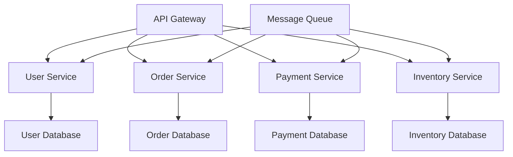

### **Key Principles**
1. **Single Responsibility**: One business capability per service
2. **Independent Deployment**: Deploy services independently
3. **Decentralized Data**: Each service owns its data
4. **Fault Tolerance**: Handle service failures gracefully
5. **Automation**: CI/CD for each service

### **Communication Patterns**
| Pattern | Description | Use Case |
|---------|-------------|----------|
| Synchronous | Direct API calls | Real-time requirements |
| Asynchronous | Message queues | Decoupled services |
| Event-Driven | Event streaming | Loose coupling |
| API Gateway | Single entry point | External clients |

### **Why This Matters in Real Systems**
- **Scalability**: Scale individual services
- **Team Autonomy**: Independent development teams
- **Technology Diversity**: Different tech stacks per service

### **SRE/Production Relevance**
- **Service Discovery**: Dynamic service registration
- **Circuit Breakers**: Prevent cascade failures
- **Distributed Tracing**: Track requests across services
- **Health Checks**: Monitor service availability

### **Common Mistakes**
- ❌ Distributed monolith (tight coupling)
- ❌ Ignoring network latency
- ❌ No service monitoring
- ❌ Shared databases
- ❌ Synchronous communication overload

### **Interview Answer in 30 Seconds**
"Microservices architecture breaks applications into small, independent services that communicate via APIs. Each service owns its data and can be deployed independently. This enables team autonomy, technology diversity, and individual service scaling, but adds complexity in communication and monitoring."

---

## 🌊 **Event-Driven Architecture**

### **Event-Driven Pattern**
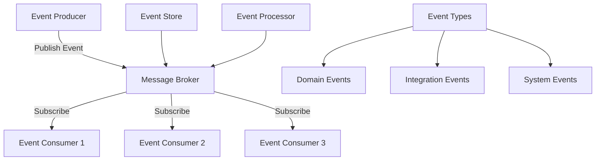

### **Event Types**
| Type | Description | Example |
|------|-------------|---------|
| Domain | Business events | OrderPlaced, PaymentProcessed |
| Integration | Cross-system | UserCreated, OrderUpdated |
| System | Technical | ServiceStarted, ErrorOccurred |

### **Message Broker Options**
| Broker | Features | Use Case |
|--------|----------|---------|
| RabbitMQ | AMQP, flexible routing | Complex routing needs |
| Kafka | High throughput, log-based | Event streaming |
| Redis Pub/Sub | Simple, fast | Real-time notifications |
| AWS SQS | Cloud-native | AWS integration |

### **Why This Matters in Real Systems**
- **Decoupling**: Services don't need to know about each other
- **Scalability**: Consumers can scale independently
- **Reliability**: Message persistence and retry mechanisms
- **Audit Trail**: Event log provides audit trail

### **SRE/Production Relevance**
- **Message Monitoring**: Track queue depths, processing times
- **Dead Letter Queues**: Handle failed messages
- **Backpressure**: Handle consumer overload
- **Event Replay**: Replay events for recovery

### **Interview Answer in 30 Seconds**
"Event-driven architecture uses events to communicate between services. Producers publish events to message brokers, and consumers subscribe to relevant events. This enables loose coupling, scalability, and reliability, but requires careful handling of message ordering and failures."

---

## 📋 **Architectural Patterns Summary**

### **Pattern Selection Guide**
| Requirement | Best Pattern | Why |
|-------------|--------------|-----|
| Small team, simple app | Monolithic | Easier development, deployment |
| Large team, complex app | Microservices | Team autonomy, independent scaling |
| Real-time updates | Event-Driven | Loose coupling, scalability |
| Traditional enterprise | Multi-tier | Clear separation of concerns |

### **Cross-Topic Connections**
- **Microservices** ↔ **API Gateway** ↔ **Load Balancing**
- **Event-Driven** ↔ **Message Queues** ↔ **Reliability**
- **Multi-Tier** ↔ **Database** ↔ **Caching**
- **Architecture** ↔ **Scalability** ↔ **Performance**

---

# SECTION 5: WEB CONCEPTS

## 🔄 **Web Sessions: Managing State in Web Applications**

### **Session Management Strategies**
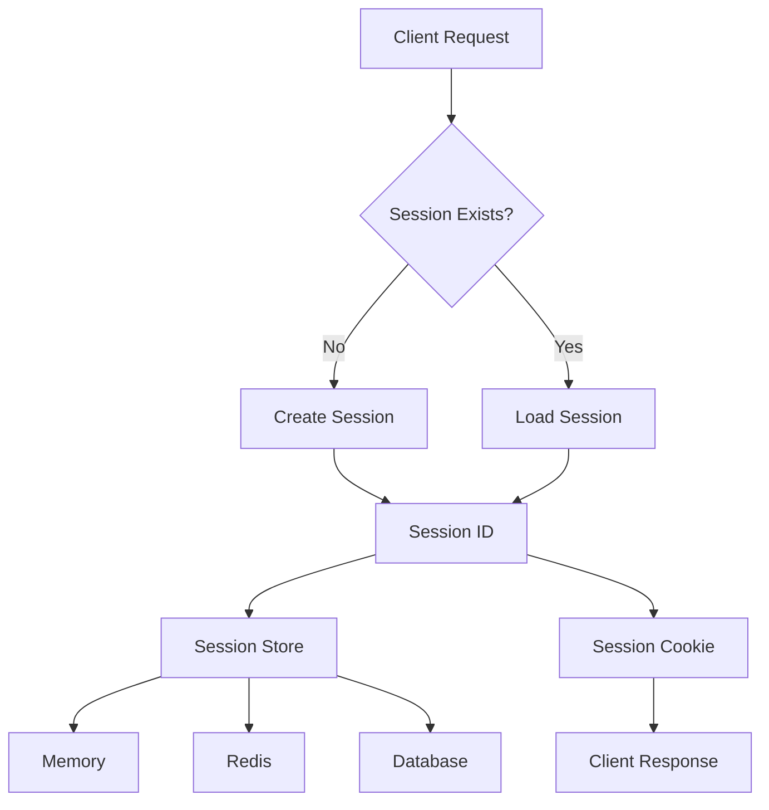

### **Session Storage Options**
| Storage | Pros | Cons | Use Case |
|---------|------|------|---------|
| Memory | Fast | Not scalable, lost on restart | Development, small apps |
| Redis | Fast, persistent | Single point of failure | Production, distributed |
| Database | Persistent, reliable | Slow | Large sessions, analytics |
| JWT | Stateless, scalable | Size limits, revocation | APIs, microservices |

### **Why This Matters in Real Systems**
- **User Experience**: Maintain login state, shopping cart
- **Security**: Session hijacking, fixation attacks
- **Scalability**: Session state across multiple servers

### **SRE/Production Relevance**
- **Session Monitoring**: Track active sessions, expiration
- **Security**: Detect session anomalies, attacks
- **Performance**: Session store latency impact

### **Common Mistakes**
- ❌ Storing too much data in sessions
- ❌ Not implementing session timeout
- ❌ Insecure session ID generation
- ❌ Not handling session expiration properly

### **Interview Answer in 30 Seconds**
"Web sessions maintain user state across HTTP requests. Sessions can be stored in memory, Redis, or databases, with trade-offs in performance and scalability. Session IDs are sent via cookies, requiring proper security measures to prevent hijacking."

---

## 📦 **Serialization: Data Exchange & Storage Formats**

### **Serialization Formats Comparison**
| Format | Human Readable | Speed | Size | Use Case |
|--------|----------------|-------|------|---------|
| JSON | ✅ | Medium | Medium | APIs, web |
| XML | ✅ | Slow | Large | Enterprise, SOAP |
| Protocol Buffers | ❌ | Fast | Small | Microservices, gRPC |
| MessagePack | ❌ | Fast | Small | High performance |
| Avro | ❌ | Fast | Small | Big Data, streaming |

### **JSON vs Protocol Buffers Example**
```json
// JSON
{
  "user_id": 123,
  "name": "John Doe",
  "email": "john@example.com"
}
```

```protobuf
// Protocol Buffers
message User {
  int32 user_id = 1;
  string name = 2;
  string email = 3;
}
```

### **Why This Matters in Real Systems**
- **Performance**: Serialization affects API response times
- **Bandwidth**: Format size impacts network usage
- **Compatibility**: Schema evolution and versioning

### **SRE/Production Relevance**
- **Performance Monitoring**: Serialization/deserialization times
- **Schema Management**: Version compatibility, migration
- **Debugging**: Human-readable vs binary formats

### **Interview Answer in 30 Seconds**
"Serialization converts data structures to storable formats. JSON is human-readable and widely used, while Protocol Buffers offer better performance and smaller size for microservices. Choice depends on performance requirements and ecosystem needs."

---

## 🔒 **CORS: Cross-Origin Resource Sharing & Web Security**

### **CORS Flow**
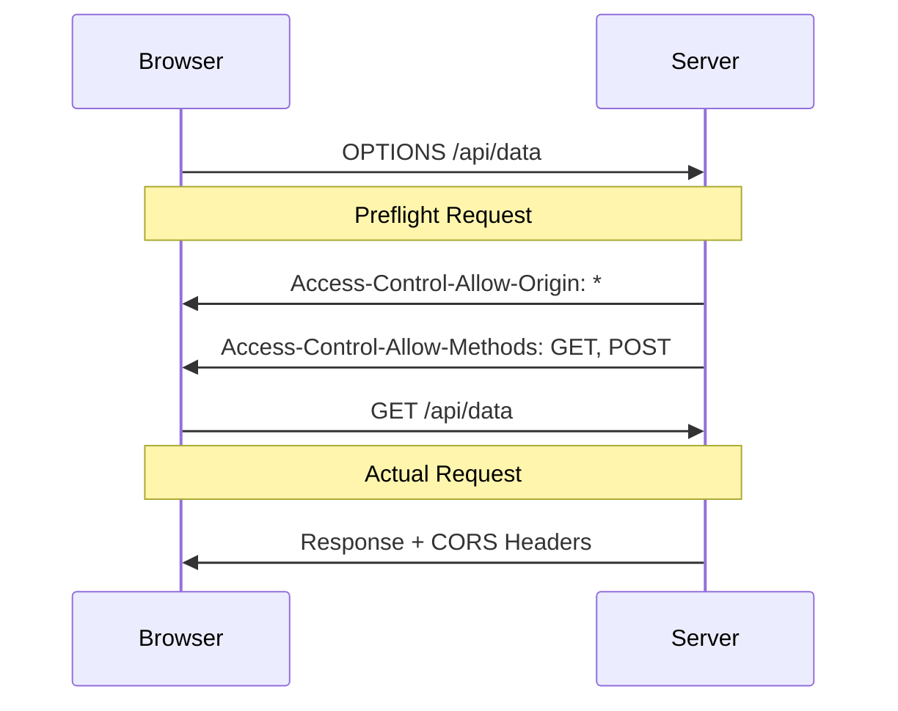

### **CORS Headers**
| Header | Purpose | Example |
|--------|---------|---------|
| Access-Control-Allow-Origin | Which origins allowed | * or specific domain |
| Access-Control-Allow-Methods | Allowed HTTP methods | GET, POST, PUT |
| Access-Control-Allow-Headers | Allowed request headers | Content-Type, Authorization |
| Access-Control-Max-Age | Preflight cache time | 86400 |

### **Security Implications**
- **Same-Origin Policy**: Browser security model
- **Preflight Requests**: OPTIONS method for validation
- **Credentials**: Cookies, authentication headers

### **Why This Matters in Real Systems**
- **Security**: Prevent unauthorized cross-origin requests
- **API Access**: Control who can consume your API
- **Development**: Frontend-backend separation

### **SRE/Production Relevance**
- **Security Headers**: Monitor CORS configuration
- **API Gateway**: Centralized CORS management
- **Error Handling**: Proper CORS error responses

### **Common Mistakes**
- ❌ Using wildcard (*) in production
- ❌ Not handling preflight requests
- ❌ Ignoring credentials in CORS
- ❌ Overly permissive CORS policies

### **Interview Answer in 30 Seconds**
"CORS is a security mechanism that allows or denies cross-origin requests based on server headers. It uses preflight OPTIONS requests to validate permissions before actual requests. Proper CORS configuration is essential for web security and API access control."

---

## 📋 **Web Concepts Summary**

### **Key Takeaways**
1. **Sessions**: State management across HTTP requests
2. **Serialization**: Data format selection impacts performance
3. **CORS**: Security for cross-origin requests
4. **Stateless Design**: RESTful principles
5. **Security Headers**: Protection against web vulnerabilities

### **Cross-Topic Connections**
- **Sessions** ↔ **Authentication** ↔ **Security**
- **Serialization** ↔ **API Design** ↔ **Performance**
- **CORS** ↔ **API Gateway** ↔ **Security**
- **Web Concepts** ↔ **HTTP** ↔ **REST**

---

# SECTION 6: SCALABILITY

## 📈 **Introduction to Scalability**

### **Scalability Dimensions**
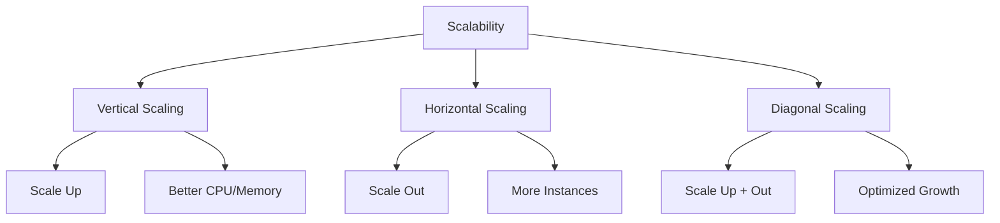

### **Scalability vs Performance vs Availability**
| Concept | Focus | Metric | Trade-off |
|---------|-------|--------|-----------|
| Performance | Speed | Latency, throughput | Resource usage |
| Scalability | Growth | Users, requests | Complexity |
| Availability | Uptime | Uptime percentage | Cost, redundancy |

### **Why This Matters in Real Systems**
- **Growth**: Handle increasing user base
- **Cost**: Optimize resource utilization
- **User Experience**: Maintain performance under load

### **SRE/Production Relevance**
- **Capacity Planning**: Predict resource needs
- **Auto-scaling**: Dynamic resource allocation
- **Performance Monitoring**: Track scaling effectiveness

### **Interview Answer in 30 Seconds**
"Scalability is the system's ability to handle growth. Vertical scaling increases resources (CPU/memory), horizontal scaling adds more instances, and diagonal scaling combines both. The choice depends on cost, complexity, and growth patterns."

---

## ⚖️ **Scaling Strategies: Horizontal, Vertical & Diagonal**

### **Vertical Scaling (Scale Up)**
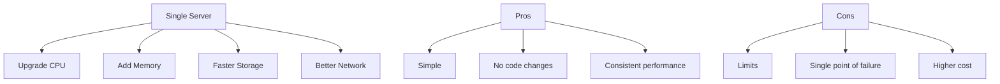

### **Horizontal Scaling (Scale Out)**
```mermaid
graph TD
    A[Load Balancer] --> B[Server 1]
    A --> C[Server 2]
    A --> D[Server 3]
    A --> E[Server N]
    
    F[Pros] --> G[Unlimited growth]
    F --> H[Better reliability]
    F --> I[Cost effective]
    
    J[Cons] --> K[Complexity]
    J --> L[Code changes]
    J --> M[Data consistency]
```

### **Diagonal Scaling (Smart Scaling)**
```mermaid
graph TD
    A[Monitor Load] --> B{High CPU?}
    B -->|Yes| C[Scale Up CPU]
    B -->|No| D{High Memory?}
    D -->|Yes| E[Scale Up Memory]
    D -->|No| F{Still High Load?}
    F -->|Yes| G[Scale Out]
    F -->|No| H[Optimize Code]
```

### **When to Use Each Strategy**
| Situation | Strategy | Reason |
|-----------|----------|--------|
| Database server | Vertical | Complex to distribute |
| Web servers | Horizontal | Easy to distribute |
| Growing startup | Diagonal | Optimize costs |
| Sudden spike | Horizontal | Quick response |

### **Why This Matters in Real Systems**
- **Cost Optimization**: Right-size resources
- **Performance**: Maintain response times
- **Reliability**: Handle component failures

### **SRE/Production Relevance**
- **Auto-scaling**: Automated resource management
- **Load Testing**: Validate scaling strategies
- **Cost Management**: Optimize cloud spending

### **Interview Answer in 30 Seconds**
"Vertical scaling increases single server resources, horizontal scaling adds more servers, and diagonal scaling intelligently combines both. Vertical is simpler but limited, horizontal is complex but unlimited, and diagonal optimizes cost and performance."

---

## ⚖️ **Understanding Load Balancers: Types, Algorithms & Cloud Solutions**

### **Load Balancer Types**
```mermaid
graph TD
    A[Load Balancers] --> B[Layer 4]
    A --> C[Layer 7]
    A --> D[Global Server Load Balancing]
    
    B --> E[TCP/UDP]
    B --> F[Network Load Balancer]
    
    C --> G[HTTP/HTTPS]
    C --> H[Application Load Balancer]
    
    D --> I[GeoDNS]
    D --> J[Anycast]
```

### **Load Balancing Algorithms**
| Algorithm | How It Works | Best For | Cloud Implementation |
|-----------|-------------|----------|---------------------|
| Round Robin | Sequential rotation | Equal servers | AWS ALB, GCP Load Balancer |
| Least Connections | Fewest active connections | Variable load | NGINX, HAProxy |
| IP Hash | Client IP determines server | Session persistence | AWS ALB stickiness |
| Weighted | Capacity-weighted | Unequal servers | Cloud custom metrics |
| Health Check | Only healthy servers | High availability | All cloud solutions |

### **Cloud Load Balancer Comparison**
| Cloud Provider | L4 Load Balancer | L7 Load Balancer | Features |
|----------------|------------------|------------------|----------|
| AWS | Network Load Balancer | Application Load Balancer | Auto-scaling, health checks |
| GCP | Network Load Balancing | HTTP(S) Load Balancing | Global load balancing |
| Azure | Load Balancer | Application Gateway | WAF, auto-scaling |
| Cloudflare | Spectrum | Load Balancer | DDoS protection, edge |

### **Why This Matters in Real Systems**
- **Availability**: Remove failed servers automatically
- **Performance**: Distribute load optimally
- **Scalability**: Add/remove servers dynamically

### **SRE/Production Relevance**
- **Health Checks**: Monitor server availability
- **Metrics**: Track distribution effectiveness
- **Failover**: Handle load balancer failures
- **SSL Termination**: Centralize certificate management

### **Interview Answer in 30 Seconds**
"Load balancers distribute traffic across multiple servers using algorithms like round robin or least connections. Layer 4 works at transport level, Layer 7 at application level. Cloud solutions provide managed load balancing with auto-scaling and health checks."

---

## 🔄 **Autoscaling & Best Practices in Cloud Environments**

### **Autoscaling Architecture**
```mermaid
graph TD
    A[Metrics Monitor] --> B{Scale Up?}
    A --> C{Scale Down?}
    
    B -->|Yes| D[Add Instance]
    C -->|Yes| E[Remove Instance]
    
    D --> F[Load Balancer]
    E --> F
    
    F --> G[Application Servers]
    
    H[Cloud Watch] --> A
    I[Custom Metrics] --> A
    J[Health Checks] --> A
```

### **Autoscaling Triggers**
| Trigger Type | Example | Threshold |
|--------------|---------|-----------|
| CPU Utilization | Average CPU > 80% | 5 minutes |
| Memory Usage | Memory > 90% | 3 minutes |
| Request Count | Requests/sec > 1000 | 2 minutes |
| Queue Depth | SQS messages > 100 | 1 minute |
| Custom Metrics | Business KPI | Variable |

### **Autoscaling Policies**
| Policy | Description | Use Case |
|--------|-------------|---------|
| Target Tracking | Maintain target metric | Steady workloads |
| Predictive | ML-based prediction | Predictable patterns |
| Scheduled | Time-based scaling | Known traffic patterns |
| Step Scaling | Gradual changes | Prevent thrashing |

### **Cloud Autoscaling Comparison**
| Cloud | Service | Features | SRE Benefits |
|-------|---------|----------|-------------|
| AWS | Auto Scaling Groups | Target tracking, predictive | Integration with CloudWatch |
| GCP | Autoscaler | CPU, custom metrics | Managed instance groups |
| Azure | Virtual Machine Scale Sets | Custom schedules | Integration with Azure Monitor |
| Kubernetes | HPA/VPA | Pod-level scaling | Resource optimization |

### **Why This Matters in Real Systems**
- **Cost Efficiency**: Pay only for needed resources
- **Performance**: Maintain performance under load
- **Reliability**: Handle traffic spikes automatically

### **SRE/Production Relevance**
- **Cost Monitoring**: Track scaling costs
- **Performance Impact**: Monitor scaling events
- **Configuration**: Optimize thresholds and policies
- **Testing**: Validate autoscaling behavior

### **Common Mistakes**
- ❌ Setting thresholds too low/high
- ❌ Ignoring scaling delays
- ❌ Not testing scaling scenarios
- ❌ Forgetting about database scaling
- ❌ Not considering network limits

### **Interview Answer in 30 Seconds**
"Autoscaling automatically adjusts resources based on metrics like CPU or request count. Cloud solutions offer target tracking, predictive scaling, and scheduled policies. Proper thresholds and monitoring are essential to prevent thrashing and ensure cost efficiency."

---

## 📋 **Scalability Summary**

### **Key Takeaways**
1. **Scaling Types**: Vertical, horizontal, diagonal strategies
2. **Load Balancing**: Algorithms and cloud solutions
3. **Autoscaling**: Metrics, triggers, and policies
4. **Cost Optimization**: Right-size resources
5. **Performance**: Maintain response times under load

### **Cross-Topic Connections**
- **Scalability** ↔ **Load Balancing** ↔ **Availability**
- **Autoscaling** ↔ **Monitoring** ↔ **Cost Management**
- **Horizontal Scaling** ↔ **Microservices** ↔ **Distributed Systems**
- **Performance** ↔ **Caching** ↔ **Database Optimization**

---

# SECTION 7: STORAGE + CAP THEOREM

## 💾 **Introduction to Storage in System Design + CAP Theorem**

### **Storage Hierarchy**
```mermaid
graph TD
    A[Storage Types] --> B[Relational]
    A --> C[NoSQL]
    A --> D[Object Storage]
    A --> E[File Systems]
    A --> F[In-Memory]
    
    B --> G[ACID Properties]
    C --> H[BASE Properties]
    D --> I[Unstructured Data]
    E --> J[Hierarchical]
    F --> K[Fast Access]
```

### **CAP Theorem Explained**
```mermaid
graph TD
    A[CAP Theorem] --> B[Consistency]
    A --> C[Availability]
    A --> D[Partition Tolerance]
    
    E[Choose 2 of 3] --> F[CP]
    E --> G[AP]
    E --> H[CA]
    
    F --> I[Consistency + Partition]
    G --> J[Availability + Partition]
    H --> K[Consistency + Availability]
```

### **CAP Trade-offs**
| System | Consistency | Availability | Partition | Use Case |
|---------|-------------|-------------|-----------|----------|
| RDBMS | ✅ | ❌ | ✅ | Financial systems |
| NoSQL | ❌ | ✅ | ✅ | Social media |
| CA Systems | ✅ | ✅ | ❌ | Single data center |

### **Why This Matters in Real Systems**
- **Data Integrity**: Choose consistency for critical data
- **User Experience**: Choose availability for better UX
- **Network Reality**: Partition tolerance is mandatory

### **SRE/Production Relevance**
- **Replication**: Handle network partitions
- **Consistency**: Monitor data consistency
- **Availability**: Ensure service uptime

### **Interview Answer in 30 Seconds**
"CAP theorem states that distributed systems can only provide two out of three guarantees: consistency, availability, and partition tolerance. Since network partitions are inevitable, systems must choose between consistency (CP) or availability (AP)."

---

## 🗄️ **Understanding Database Models: SQL vs NoSQL**

### **SQL vs NoSQL Comparison**
| Aspect | SQL | NoSQL |
|--------|-----|-------|
| Data Model | Relational | Document, Key-value, Graph |
| Schema | Fixed | Flexible |
| Consistency | Strong | Eventual |
| Scaling | Vertical | Horizontal |
| Query Language | SQL | Varies |
| Use Cases | Transactions, Analytics | Big Data, Real-time |

### **SQL Databases**
```mermaid
graph TD
    A[SQL Database] --> B[Tables]
    B --> C[Rows]
    B --> D[Columns]
    B --> E[Relationships]
    
    F[Examples] --> G[PostgreSQL]
    F --> H[MySQL]
    F --> I[SQL Server]
    F --> J[Oracle]
    
    K[Features] --> L[ACID]
    K --> M[JOINs]
    K --> N[Transactions]
```

### **NoSQL Database Types**
| Type | Description | Examples | Use Cases |
|------|-------------|----------|----------|
| Document | JSON documents | MongoDB, CouchDB | Content management |
| Key-Value | Simple key-value | Redis, DynamoDB | Caching, sessions |
| Column-family | Wide columns | Cassandra, HBase | Big data analytics |
| Graph | Nodes and relationships | Neo4j, ArangoDB | Social networks |

### **When to Use Which**
| Requirement | SQL | NoSQL |
|-------------|-----|-------|
| ACID transactions | ✅ | ❌ |
| Complex queries | ✅ | ❌ |
| Huge scale | ❌ | ✅ |
| Flexible schema | ❌ | ✅ |
| Real-time | ❌ | ✅ |

### **Why This Matters in Real Systems**
- **Data Integrity**: SQL for financial, critical data
- **Scalability**: NoSQL for big data applications
- **Development Speed**: NoSQL for rapid prototyping

### **SRE/Production Relevance**
- **Backup Strategies**: Different approaches for SQL vs NoSQL
- **Monitoring**: Database-specific metrics
- **Scaling**: Horizontal vs vertical scaling

### **Interview Answer in 30 Seconds**
"SQL databases offer strong consistency and ACID properties with fixed schemas, ideal for financial applications. NoSQL provides flexible schemas and horizontal scalability for big data and real-time applications. The choice depends on consistency requirements and scale needs."

---

## 🔧 **Advanced Database Topics: Sharding, Replication & Polyglot Persistence**

### **Database Sharding**
```mermaid
graph TD
    A[Application] --> B[Sharding Layer]
    B --> C[Shard 1]
    B --> D[Shard 2]
    B --> E[Shard 3]
    B --> F[Shard N]
    
    G[Sharding Strategies] --> H[Range-based]
    G --> I[Hash-based]
    G --> J[Directory-based]
```

### **Sharding Strategies**
| Strategy | How It Works | Pros | Cons |
|----------|--------------|------|------|
| Range-based | Data ranges by key | Simple queries | Hot spots |
| Hash-based | Hash function distributes | Even distribution | Rebalancing complexity |
| Directory-based | Lookup table determines shard | Flexible | Additional lookup |

### **Database Replication**
```mermaid
graph TD
    A[Primary] -->|Sync| B[Replica 1]
    A -->|Async| C[Replica 2]
    A -->|Semi-sync| D[Replica 3]
    
    E[Read Operations] --> F[Replicas]
    G[Write Operations] --> A
    
    H[Failover] --> I[New Primary]
```

### **Replication Types**
| Type | Latency | Data Loss | Use Case |
|------|---------|-----------|----------|
| Synchronous | High | None | Financial transactions |
| Asynchronous | Low | Possible | Analytics, caching |
| Semi-synchronous | Medium | Minimal | General purpose |

### **Polyglot Persistence**
```mermaid
graph TD
    A[Application] --> B[SQL Database]
    A --> C[Document Store]
    A --> D[Key-Value Store]
    A --> E[Graph Database]
    A --> F[Search Engine]
    
    G[Use Cases] --> H[Users - SQL]
    G --> I[Products - Document]
    G --> J[Sessions - Key-Value]
    G --> K[Social - Graph]
    G --> L[Search - Search Engine]
```

### **Why This Matters in Real Systems**
- **Scalability**: Sharding enables horizontal scaling
- **Reliability**: Replication provides high availability
- **Flexibility**: Polyglot persistence uses right tool for job

### **SRE/Production Relevance**
- **Shard Management**: Monitor shard balance
- **Replication Lag**: Track replica synchronization
- **Multi-Database**: Complex monitoring and backup

### **Interview Answer in 30 Seconds**
"Sharding distributes data across multiple databases for horizontal scaling. Replication creates copies for high availability. Polyglot persistence uses different database types for different use cases, optimizing performance and functionality."

---

## 📦 **Object Storage in Modern Systems**

### **Object Storage Architecture**
```mermaid
graph TD
    A[Client] --> B[API Gateway]
    B --> C[Authentication]
    B --> D[Object Storage]
    
    D --> E[Bucket 1]
    D --> F[Bucket 2]
    D --> G[Bucket N]
    
    E --> H[Object 1]
    E --> I[Object 2]
    E --> J[Object N]
    
    K[Features] --> L[Versioning]
    K --> M[Encryption]
    K --> N[Access Control]
    K --> O[CDN Integration]
```

### **Object Storage vs File Storage**
| Aspect | Object Storage | File Storage |
|--------|---------------|--------------|
| Structure | Flat with metadata | Hierarchical |
| Scaling | Unlimited | Limited |
| Access | REST API | File system |
| Metadata | Rich | Basic |
| Use Case | Unstructured data | Structured files |

### **Object Storage Providers**
| Provider | Service | Features | Pricing |
|----------|---------|----------|---------|
| AWS | S3 | Versioning, encryption | Pay-per-use |
| GCP | Cloud Storage | Multi-regional | Pay-per-use |
| Azure | Blob Storage | Hot/cold tiers | Pay-per-use |
| MinIO | Self-hosted | S3-compatible | Infrastructure cost |

### **Use Cases**
- **Media Storage**: Images, videos, audio
- **Backup and Archive**: Long-term data retention
- **Big Data**: Analytics data lakes
- **Content Distribution**: Static assets for CDN

### **Why This Matters in Real Systems**
- **Scalability**: Virtually unlimited storage
- **Durability**: Built-in redundancy and replication
- **Cost**: Pay-per-use pricing model

### **SRE/Production Relevance**
- **Access Monitoring**: Track API usage and costs
- **Lifecycle Management**: Automate data transitions
- **Security**: Manage access policies and encryption

### **Interview Answer in 30 Seconds**
"Object storage stores data as objects with metadata, accessed via REST APIs. It offers unlimited scalability, built-in durability, and pay-per-use pricing. Ideal for unstructured data like images, videos, and backups."

---

## 📁 **File Systems and Distributed Storage**

### **Distributed File Systems**
```mermaid
graph TD
    A[Client] --> B[Distributed File System]
    B --> C[Node 1]
    B --> D[Node 2]
    B --> E[Node 3]
    B --> F[Node N]
    
    G[Features] --> H[Replication]
    G --> I[Consistency]
    G --> J[Fault Tolerance]
    G --> K[Scalability]
```

### **Distributed File Systems Comparison**
| System | Architecture | Consistency | Use Case |
|---------|--------------|------------|----------|
| HDFS | Master-slave | Strong | Big data processing |
| GlusterFS | Peer-to-peer | Configurable | General purpose |
| Ceph | RADOS | Strong | Cloud storage |
| NFS | Centralized | Strong | Traditional file sharing |

### **File System Concepts**
- **Inodes**: Metadata about files
- **Blocks**: Data storage units
- **Journaling**: Transaction logging
- **Snapshots**: Point-in-time copies

### **Why This Matters in Real Systems**
- **Performance**: File system performance affects applications
- **Reliability**: Distributed systems handle failures
- **Scalability**: Handle growing storage needs

### **SRE/Production Relevance**
- **Performance Monitoring**: I/O metrics, latency
- **Capacity Planning**: Storage growth prediction
- **Backup Strategies**: Distributed backup complexity

---

## 📊 **Big Data Fundamentals**

### **Big Data Characteristics (3V's)**
```mermaid
graph TD
    A[Big Data] --> B[Volume]
    A --> C[Velocity]
    A --> D[Variety]
    
    B --> E[Terabytes to Petabytes]
    C --> F[Real-time to Batch]
    D --> G[Structured to Unstructured]
```

### **Big Data Stack**
```mermaid
graph TD
    A[Data Sources] --> B[Data Ingestion]
    B --> C[Data Storage]
    C --> D[Data Processing]
    D --> E[Data Analysis]
    E --> F[Visualization]
    
    G[Technologies] --> H[Kafka]
    G --> I[Hadoop]
    G --> J[Spark]
    G --> K[Flink]
    G --> L[Elasticsearch]
```

### **Big Data Processing Patterns**
| Pattern | Description | Technology |
|---------|-------------|------------|
| Batch Processing | Process large datasets periodically | Hadoop MapReduce |
| Stream Processing | Process data in real-time | Kafka Streams, Flink |
| Lambda Architecture | Batch + Stream | Kappa Architecture |
| Kappa Architecture | Stream-only | Apache Kafka |

### **Why This Matters in Real Systems**
- **Data Volume**: Handle ever-increasing data
- **Processing Speed**: Real-time analytics requirements
- **Data Variety**: Multiple data sources and formats

### **SRE/Production Relevance**
- **Resource Management**: Cluster resource allocation
- **Job Monitoring**: Track job performance and failures
- **Data Pipeline**: Ensure data flow reliability

---

## 📋 **Storage and CAP Theorem Summary**

### **Key Takeaways**
1. **CAP Theorem**: Choose consistency or availability
2. **SQL vs NoSQL**: Trade-offs between consistency and scalability
3. **Sharding**: Horizontal data distribution
4. **Replication**: High availability through redundancy
5. **Object Storage**: Scalable unstructured data storage

### **Cross-Topic Connections**
- **CAP Theorem** ↔ **Database Choice** ↔ **Consistency**
- **Sharding** ↔ **Scalability** ↔ **Performance**
- **Replication** ↔ **Reliability** ↔ **Availability**
- **Object Storage** ↔ **CDN** ↔ **Performance**

---

# SECTION 8: PERFORMANCE

## ⚡ **Introduction to System Performance**

### **Performance Metrics**
```mermaid
graph TD
    A[Performance Metrics] --> B[Latency]
    A --> C[Throughput]
    A --> D[Resource Utilization]
    A --> E[Error Rate]
    
    B --> F[Response Time]
    B --> G[Network Delay]
    
    C --> H[Requests/Second]
    C --> I[Data Transfer Rate]
    
    D --> J[CPU Usage]
    D --> K[Memory Usage]
    D --> L[Disk I/O]
    
    E --> M[4xx Errors]
    E --> N[5xx Errors]
```

### **Performance Optimization Pyramid**
```mermaid
graph TD
    A[Performance Optimization] --> B[Algorithmic]
    A --> C[Application]
    A --> D[System]
    A --> E[Network]
    
    B --> F[O(n) vs O(1)]
    C --> G[Caching, Pooling]
    D --> H[Hardware, OS]
    E --> I[CDN, Compression]
```

### **Why Performance Matters**
- **User Experience**: Faster sites = better UX
- **Conversion**: Performance impacts business metrics
- **SEO**: Page speed affects search rankings
- **Cost**: Better performance = lower infrastructure costs

### **SRE/Production Relevance**
- **SLA Compliance**: Meet performance requirements
- **Capacity Planning**: Predict performance bottlenecks
- **Cost Optimization**: Right-size resources

### **Interview Answer in 30 Seconds**
"System performance encompasses latency, throughput, resource utilization, and error rates. Optimization happens at multiple levels from algorithms to network. Good performance directly impacts user experience and business metrics."

---

## 🚀 **Caching for Speed Optimization**

### **Caching Hierarchy**
```mermaid
graph TD
    A[Client] --> B[Browser Cache]
    B --> C[CDN Cache]
    C --> D[Application Cache]
    D --> E[Database Cache]
    E --> F[Disk Cache]
    
    G[Cache Types] --> H[Read-Through]
    G --> I[Write-Through]
    G --> J[Write-Behind]
    G --> K[Refresh-Ahead]
```

### **Cache Strategies**
| Strategy | Write Behavior | Read Behavior | Use Case |
|----------|----------------|---------------|----------|
| Cache-Aside | App writes to cache | App checks cache | General purpose |
| Read-Through | App writes to DB | Cache manages reads | Simple implementation |
| Write-Through | Cache writes to DB | Cache serves reads | Data consistency |
| Write-Behind | Cache writes async | Cache serves reads | High write throughput |

### **Cache Eviction Policies**
| Policy | How It Works | Use Case |
|--------|--------------|----------|
| LRU | Remove least recently used | General purpose |
| LFU | Remove least frequently used | Access patterns |
| FIFO | Remove oldest entries | Simple implementation |
| TTL | Time-based expiration | Time-sensitive data |

### **Redis vs Memcached**
| Feature | Redis | Memcached |
|---------|-------|-----------|
| Data Types | Strings, lists, sets, hashes | Strings only |
| Persistence | Yes (RDB/AOF) | No |
| Replication | Yes | No |
| Clustering | Yes | No |
| Memory Efficiency | Lower | Higher |

### **Why This Matters in Real Systems**
- **Performance**: Dramatic response time improvement
- **Database Load**: Reduce database queries
- **Scalability**: Handle more requests with same resources

### **SRE/Production Relevance**
- **Cache Hit Ratio**: Monitor cache effectiveness
- **Cache Invalidation**: Update strategies
- **Memory Management**: Cache size optimization
- **Distributed Caching**: Consistency challenges

### **Common Mistakes**
- ❌ Not considering cache invalidation
- ❌ Caching everything (memory waste)
- ❌ Ignoring cache stampede
- ❌ Not monitoring cache performance
- ❌ Poor cache key design

### **Interview Answer in 30 Seconds**
"Caching stores frequently accessed data in fast storage to improve performance. Common patterns include cache-aside, read-through, and write-through. Redis offers rich data types and persistence, while Memcached is simpler and more memory-efficient."

---

## 📨 **Messaging & Queues for Decoupling**

### **Message Queue Architecture**
```mermaid
graph TD
    A[Producer] --> B[Message Broker]
    B --> C[Queue 1]
    B --> D[Queue 2]
    B --> E[Queue N]
    
    C --> F[Consumer 1]
    D --> G[Consumer 2]
    E --> H[Consumer N]
    
    I[Features] --> J[Persistence]
    I --> K[Retry Logic]
    I --> L[Dead Letter Queue]
    I --> M[Ordering]
```

### **Message Queue Comparison**
| Queue | Features | Use Case | SRE Benefits |
|-------|----------|----------|--------------|
| RabbitMQ | AMQP, flexible routing | Complex routing | Rich monitoring |
| Kafka | High throughput, log-based | Event streaming | Scalable |
| AWS SQS | Cloud-native, simple | AWS integration | Managed service |
| Redis Pub/Sub | Fast, in-memory | Real-time notifications | Simple deployment |

### **Messaging Patterns**
| Pattern | Description | Benefits |
|---------|-------------|----------|
| Point-to-Point | One consumer per message | Load distribution |
| Publish-Subscribe | Multiple consumers | Loose coupling |
| Request-Reply | Synchronous response | RPC-style |
| Event Sourcing | Immutable event log | Audit trail |

### **Why This Matters in Real Systems**
- **Decoupling**: Services don't need to know about each other
- **Reliability**: Message persistence ensures delivery
- **Scalability**: Consumers can scale independently
- **Performance**: Asynchronous processing improves responsiveness

### **SRE/Production Relevance**
- **Queue Monitoring**: Depth, processing rates
- **Dead Letter Queues**: Handle failed messages
- **Backpressure**: Manage consumer overload
- **Message Tracing**: Track message flow

### **Interview Answer in 30 Seconds**
"Message queues enable asynchronous communication between services through brokers like RabbitMQ or Kafka. They provide decoupling, reliability, and scalability. Common patterns include point-to-point for load distribution and pub-sub for broadcasting."

---

## ⚡ **Concurrency & Parallelism**

### **Concurrency vs Parallelism**
```mermaid
graph TD
    A[Concurrency] --> B[Multiple Tasks]
    A --> C[Same Time]
    A --> D[Progress Switching]
    
    E[Parallelism] --> F[Multiple Tasks]
    E --> G[Same Time]
    E --> H[Simultaneous Execution]
    
    I[Implementation] --> J[Threads]
    I --> K[Processes]
    I --> L[Async/Await]
    I --> M[Coroutines]
```

### **Concurrency Models**
| Model | Description | Use Case |
|-------|-------------|----------|
| Multi-threading | Shared memory threads | CPU-bound tasks |
| Multi-processing | Separate processes | CPU-bound, isolation |
| Async I/O | Event-driven | I/O-bound tasks |
| Actor Model | Message passing | Distributed systems |

### **Thread Pool Pattern**
```mermaid
graph TD
    A[Task Queue] --> B[Thread Pool]
    B --> C[Worker Thread 1]
    B --> D[Worker Thread 2]
    B --> E[Worker Thread N]
    
    F[Completed Tasks] --> G[Result Queue]
    
    C --> F
    D --> F
    E --> F
```

### **Why This Matters in Real Systems**
- **Performance**: Utilize multi-core processors
- **Responsiveness**: Non-blocking user interfaces
- **Throughput**: Handle multiple requests simultaneously

### **SRE/Production Relevance**
- **Resource Management**: Thread/process limits
- **Deadlock Detection**: Prevent system freezes
- **Performance Monitoring**: Thread utilization

### **Common Mistakes**
- ❌ Race conditions
- ❌ Deadlocks
- ❌ Thread leaks
- ❌ Over-synchronization
- ❌ Ignoring context switching overhead

### **Interview Answer in 30 Seconds**
"Concurrency handles multiple tasks progressing simultaneously, while parallelism executes tasks simultaneously. Thread pools manage worker threads efficiently. Concurrency improves responsiveness and utilizes multi-core processors effectively."

---

## 🗄️ **Database Performance Optimization Techniques**

### **Database Optimization Pyramid**
```mermaid
graph TD
    A[Database Performance] --> B[Query Optimization]
    A --> C[Indexing]
    A --> D[Schema Design]
    A --> E[Hardware]
    
    B --> F[EXPLAIN plans]
    B --> G[Query rewriting]
    
    C --> H[B-tree indexes]
    C --> I[Hash indexes]
    C --> J[Composite indexes]
    
    D --> K[Normalization]
    D --> L[Denormalization]
    D --> M[Partitioning]
```

### **Query Optimization Techniques**
| Technique | Description | Impact |
|-----------|-------------|--------|
| EXPLAIN Analyze | Query execution plan | Identify bottlenecks |
| Query Rewriting | Optimize SQL syntax | Better execution plans |
| Prepared Statements | Pre-compiled queries | Reduced parsing overhead |
| Connection Pooling | Reuse connections | Lower connection overhead |

### **Indexing Strategies**
| Index Type | Use Case | Considerations |
|------------|----------|----------------|
| B-tree | Range queries, sorting | Balanced tree structure |
| Hash | Equality lookups | Fixed-size keys |
| Composite | Multiple columns | Column order matters |
| Partial | Filtered data | Reduced index size |

### **Database Partitioning**
```mermaid
graph TD
    A[Table] --> B[Horizontal Partitioning]
    A --> C[Vertical Partitioning]
    
    B --> D[Range Partition]
    B --> E[List Partition]
    B --> F[Hash Partition]
    
    C --> G[Column Split]
    C --> H[Functional Split]
```

### **Why This Matters in Real Systems**
- **Query Performance**: Faster data retrieval
- **Scalability**: Handle larger datasets
- **Resource Efficiency**: Optimize CPU, memory, I/O

### **SRE/Production Relevance**
- **Query Monitoring**: Slow query identification
- **Index Usage**: Monitor index effectiveness
- **Connection Management**: Pool sizing and timeouts

### **Interview Answer in 30 Seconds**
"Database performance optimization involves query optimization, proper indexing, and schema design. EXPLAIN analyzes query plans, appropriate indexes speed up lookups, and partitioning handles large datasets. Connection pooling reduces overhead."

---

## 📋 **Performance Summary**

### **Key Takeaways**
1. **Caching**: Multiple layers and strategies
2. **Message Queues**: Asynchronous processing
3. **Concurrency**: Utilize multi-core systems
4. **Database Optimization**: Queries, indexes, schema
5. **Monitoring**: Track performance metrics

### **Cross-Topic Connections**
- **Caching** ↔ **Database** ↔ **Performance**
- **Message Queues** ↔ **Microservices** ↔ **Scalability**
- **Concurrency** ↔ **System Resources** ↔ **SRE**
- **Performance** ↔ **User Experience** ↔ **Business Metrics**

---

# SECTION 9: RELIABILITY

## 🛡️ **Introduction to System Reliability**

### **Reliability Metrics**
```mermaid
graph TD
    A[Reliability Metrics] --> B[Uptime]
    A --> C[MTBF]
    A --> D[MTTR]
    A --> E[Availability]
    
    B --> F[99.9% = 8.76h downtime/year]
    B --> G[99.99% = 52.6m downtime/year]
    B --> H[99.999% = 5.26m downtime/year]
    
    C --> I[Mean Time Between Failures]
    D --> J[Mean Time To Repair]
    
    E --> K[Availability Percentage]
```

### **Reliability vs Availability vs Durability**
| Concept | Definition | Focus | SRE Impact |
|---------|------------|-------|------------|
| Reliability | Probability of failure-free operation | Failure prevention | Preventive maintenance |
| Availability | System is operational when needed | Uptime | Redundancy, failover |
| Durability | Data survives failures | Data persistence | Backups, replication |

### **Why Reliability Matters**
- **User Trust**: Reliable systems build user confidence
- **Revenue**: Downtime directly impacts revenue
- **Reputation**: Outages damage brand reputation
- **Cost**: Failures are expensive to fix

### **SRE/Production Relevance**
- **SLA Compliance**: Meet reliability requirements
- **Error Budgets**: Balance reliability and innovation
- **Incident Management**: Quick failure response

### **Interview Answer in 30 Seconds**
"System reliability is the probability of failure-free operation over time. Key metrics include uptime percentage, MTBF (mean time between failures), and MTTR (mean time to repair). High reliability requires redundancy, monitoring, and quick incident response."

---

## 🔄 **High Availability, Fault Tolerance & Failover**

### **High Availability Architecture**
```mermaid
graph TD
    A[Load Balancer] --> B[Primary Server]
    A --> C[Secondary Server]
    A --> D[Tertiary Server]
    
    E[Health Checks] --> A
    F[Failover Detection] --> A
    
    G[Data Replication] --> B
    G --> C
    G --> D
    
    H[Shared Storage] --> B
    H --> C
    H --> D
```

### **HA Patterns**
| Pattern | Description | Use Case |
|---------|-------------|----------|
| Active-Passive | One active, one standby | Critical systems |
| Active-Active | All servers active | Load distribution |
| Multi-Active | Multiple active sites | Global systems |
| Geo-Redundant | Geographic distribution | Disaster recovery |

### **Failover Strategies**
| Strategy | Speed | Complexity | Data Loss |
|----------|-------|------------|-----------|
| Cold Standby | Minutes | Low | Possible |
| Warm Standby | Seconds | Medium | Minimal |
| Hot Standby | Milliseconds | High | None |
| Active-Active | Immediate | Very High | None |

### **Fault Tolerance Mechanisms**
```mermaid
graph TD
    A[Fault Tolerance] --> B[Redundancy]
    A --> C[Checkpointing]
    A --> D[Recovery Blocks]
    A --> E[Circuit Breakers]
    
    B --> F[Hardware Redundancy]
    B --> G[Software Redundancy]
    B --> H[Data Redundancy]
```

### **Why This Matters in Real Systems**
- **Business Continuity**: Keep systems running during failures
- **User Experience**: Minimize service disruption
- **Data Protection**: Prevent data loss during failures

### **SRE/Production Relevance**
- **Health Checks**: Monitor system health
- **Failover Testing**: Regular failover drills
- **Circuit Breakers**: Prevent cascade failures
- **Disaster Recovery**: Plan for major outages

### **Interview Answer in 30 Seconds**
"High availability ensures system uptime through redundancy and failover mechanisms. Active-passive setups provide simple failover, while active-active offers load distribution. Fault tolerance uses redundancy, checkpointing, and circuit breakers to handle failures gracefully."

---

## 💾 **Backup & Recovery Strategies**

### **Backup Strategy Pyramid**
```mermaid
graph TD
    A[Backup Strategy] --> B[3-2-1 Rule]
    A --> C[Backup Types]
    A --> D[Retention Policies]
    A --> E[Recovery Planning]
    
    B --> F[3 Copies]
    B --> G[2 Media]
    B --> H[1 Off-site]
    
    C --> I[Full Backup]
    C --> J[Incremental]
    C --> K[Differential]
```

### **Backup Types Comparison**
| Type | Speed | Storage | Recovery Time | Use Case |
|------|-------|---------|---------------|---------|
| Full | Slow | Large | Fast | Weekly backups |
| Incremental | Fast | Small | Slow | Daily backups |
| Differential | Medium | Medium | Medium | Mid-week backups |
| Snapshot | Instant | Medium | Instant | Pre-change backups |

### **Recovery Time Objectives (RTO/RPO)**
| Metric | Definition | Typical Values |
|--------|------------|---------------|
| RTO | Recovery Time Objective | Minutes to hours |
| RPO | Recovery Point Objective | Minutes to days |
| RTA | Recovery Time Actual | Measured |
| RPA | Recovery Point Actual | Measured |

### **Cloud Backup Solutions**
| Provider | Service | Features | SRE Benefits |
|----------|---------|----------|-------------|
| AWS | Backup, S3, Glacier | Lifecycle policies | Cost optimization |
| GCP | Backup, Cloud Storage | Cross-region | Compliance |
| Azure | Backup, Blob Storage | Long-term retention | Integration |
| Veeam | Cloud Backup | Hybrid | Flexibility |

### **Why This Matters in Real Systems**
- **Data Protection**: Prevent permanent data loss
- **Business Continuity**: Recover from disasters
- **Compliance**: Meet regulatory requirements
- **Incident Response**: Quick recovery from failures

### **SRE/Production Relevance**
- **Backup Monitoring**: Verify backup success
- **Recovery Testing**: Regular restore drills
- **Cost Management**: Optimize backup storage
- **Compliance**: Audit trail and retention

### **Common Mistakes**
- ❌ Not testing backups
- ❌ Ignoring backup verification
- ❌ Poor retention policies
- ❌ No off-site backups
- ❌ Not encrypting backups

### **Interview Answer in 30 Seconds**
"Backup strategies follow the 3-2-1 rule: 3 copies, 2 media types, 1 off-site. Types include full, incremental, and differential backups. RTO/RPO define recovery objectives. Cloud solutions offer automated backup with lifecycle policies."

---

## 🌪️ **Disaster Recovery in Practice**

### **Disaster Recovery Plan**
```mermaid
graph TD
    A[Disaster] --> B[Detection]
    B --> C[Assessment]
    C --> D[Response]
    D --> E[Recovery]
    E --> F[Validation]
    F --> G[Post-Mortem]
    
    H[Recovery Strategies] --> I[Hot Site]
    H --> J[Warm Site]
    H --> K[Cold Site]
    H --> L[Cloud DR]
```

### **DR Site Types**
| Type | Recovery Time | Cost | Complexity | Use Case |
|------|---------------|------|------------|----------|
| Hot Site | Minutes | High | High | Critical systems |
| Warm Site | Hours | Medium | Medium | Important systems |
| Cold Site | Days | Low | Low | Non-critical systems |
| Cloud DR | Minutes-Hours | Variable | Low-Medium | Flexible needs |

### **DR Testing Scenarios**
| Scenario | Frequency | Scope | Success Criteria |
|----------|-----------|-------|----------------|
| Tabletop Exercise | Quarterly | Planning | Plan completeness |
| Simulation | Semi-annual | Technical | System recovery |
| Full Failover | Annual | Complete | Business continuity |
| Component Test | Monthly | Specific | Component recovery |

### **Cloud DR Strategies**
```mermaid
graph TD
    A[Primary Region] --> B[Replication]
    B --> C[Secondary Region]
    
    D[DNS Failover] --> A
    D --> C
    
    E[Data Sync] --> F[Synchronous]
    E --> G[Asynchronous]
    
    H[Recovery Automation] --> I[Infrastructure as Code]
    H --> J[Orchestration]
    H --> K[Monitoring]
```

### **Why This Matters in Real Systems**
- **Business Survival**: Recover from major disasters
- **Regulatory Compliance**: Meet legal requirements
- **Customer Trust**: Demonstrate reliability
- **Risk Management**: Mitigate disaster impact

### **SRE/Production Relevance**
- **DR Drills**: Regular testing and validation
- **Automation**: Infrastructure as code for recovery
- **Monitoring**: DR system health and readiness
- **Documentation**: Updated recovery procedures

### **Interview Answer in 30 Seconds**
"Disaster recovery involves planning for major system failures. DR sites range from hot (immediate) to cold (days) with varying costs. Cloud DR offers flexible recovery with automated failover. Regular testing and automation are essential for effective DR."

---

## 📋 **Reliability Summary**

### **Key Takeaways**
1. **High Availability**: Redundancy and failover mechanisms
2. **Fault Tolerance**: Graceful failure handling
3. **Backup Strategies**: 3-2-1 rule, RTO/RPO
4. **Disaster Recovery**: Planning and testing
5. **Monitoring**: Health checks and metrics

### **Cross-Topic Connections**
- **Reliability** ↔ **Monitoring** ↔ **SRE**
- **HA** ↔ **Load Balancing** ↔ **Scalability**
- **Backup** ↔ **Storage** ↔ **CAP Theorem**
- **DR** ↔ **Cloud** ↔ **Automation**

---

# SECTION 10: SECURITY

## 🔒 **Introduction to Security in System Design**

### **Security Layers**
```mermaid
graph TD
    A[Security Layers] --> B[Network Security]
    A --> C[Application Security]
    A --> D[Data Security]
    A --> E[Infrastructure Security]
    
    B --> F[Firewalls]
    B --> G[DDoS Protection]
    B --> H[VPN]
    
    C --> I[Authentication]
    C --> J[Authorization]
    C --> K[Input Validation]
    
    D --> L[Encryption]
    D --> M[Access Control]
    D --> N[Audit Logging]
    
    E --> O[Hardening]
    E --> P[Monitoring]
    E --> Q[Backup Security]
```

### **Security Principles**
| Principle | Description | Implementation |
|-----------|-------------|----------------|
| Defense in Depth | Multiple security layers | Firewalls, WAF, encryption |
| Least Privilege | Minimum necessary access | Role-based access control |
| Zero Trust | Never trust, always verify | Continuous authentication |
| Security by Design | Built-in from start | Threat modeling, secure coding |

### **Why Security Matters**
- **Data Protection**: Prevent data breaches
- **Compliance**: Meet regulatory requirements
- **Trust**: Build customer confidence
- **Financial**: Prevent costly breaches

### **SRE/Production Relevance**
- **Security Monitoring**: Detect threats and breaches
- **Vulnerability Management**: Regular patching and updates
- **Incident Response**: Quick security incident handling
- **Compliance**: Audit trails and reporting

### **Interview Answer in 30 Seconds**
"System security involves multiple layers: network, application, data, and infrastructure. Key principles include defense in depth, least privilege, and zero trust. SREs focus on monitoring, vulnerability management, and incident response."

---

## 🔐 **Authentication & Authorization**

### **Authentication vs Authorization**
```mermaid
graph TD
    A[User] --> B[Authentication]
    B --> C[Who are you?]
    B --> D[Credentials Verified]
    
    D --> E[Authorization]
    E --> F[What can you do?]
    E --> G[Permissions Checked]
    
    G --> H[Resource Access]
```

### **Authentication Methods**
| Method | Description | Security | Use Case |
|--------|-------------|----------|----------|
| Password | Secret knowledge | Low | Basic authentication |
| 2FA/MFA | Multiple factors | High | Sensitive systems |
| Biometric | Physical traits | Very High | Mobile devices |
| Certificate | Digital certificates | High | Enterprise systems |
| Token-based | JWT, OAuth | High | APIs, microservices |

### **OAuth 2.0 Flow**
```mermaid
sequenceDiagram
    participant User
    participant Client
    participant Auth Server
    participant Resource Server
    
    User->>Client: Request resource
    Client->>Auth Server: Request authorization
    Auth Server->>User: Authenticate & authorize
    User->>Auth Server: Grant permission
    Auth Server->>Client: Authorization code
    Client->>Auth Server: Exchange code for token
    Auth Server->>Client: Access token
    Client->>Resource Server: Request with token
    Resource Server->>Client: Resource
    Client->>User: Display resource
```

### **Authorization Models**
| Model | Description | Complexity | Use Case |
|-------|-------------|------------|----------|
| RBAC | Role-based access | Low | General applications |
| ABAC | Attribute-based | High | Complex permissions |
| ACL | Access control lists | Medium | File systems |
| PBAC | Policy-based | Very High | Enterprise systems |

### **Why This Matters in Real Systems**
- **Security**: Prevent unauthorized access
- **Compliance**: Meet regulatory requirements
- **User Management**: Scalable permission systems
- **Audit**: Track access and changes

### **SRE/Production Relevance**
- **Identity Management**: Centralized user management
- **Access Monitoring**: Track authentication failures
- **Token Management**: JWT lifecycle management
- **Security Policies**: Implement and enforce policies

### **Common Mistakes**
- ❌ Weak password policies
- ❌ Not implementing MFA
- ❌ Hardcoded credentials
- ❌ Poor session management
- ❌ Ignoring token expiration

### **Interview Answer in 30 Seconds**
"Authentication verifies identity (who you are) using passwords, tokens, or biometrics. Authorization determines permissions (what you can do) through RBAC or ABAC. OAuth 2.0 enables secure third-party access with token-based authentication."

---

## 🛡️ **Data Protection & Secure Communication**

### **Encryption Overview**
```mermaid
graph TD
    A[Encryption] --> B[At Rest]
    A --> C[In Transit]
    A --> D[In Use]
    
    B --> E[Database Encryption]
    B --> F[File Encryption]
    B --> G[Disk Encryption]
    
    C --> H[TLS/SSL]
    C --> I[VPN]
    C --> J[Encrypted APIs]
    
    D --> K[Field-level Encryption]
    D --> L[Homomorphic Encryption]
```

### **Encryption Algorithms**
| Algorithm | Type | Use Case | Key Management |
|-----------|------|----------|----------------|
| AES | Symmetric | Data encryption | Secure key storage |
| RSA | Asymmetric | Key exchange | Certificate management |
| SHA-256 | Hash | Data integrity | Salt management |
| HMAC | Message auth | API security | Secret management |

### **TLS/SSL Handshake**
```mermaid
sequenceDiagram
    participant Client
    participant Server
    
    Client->>Server: Client Hello
    Server->>Client: Server Hello + Certificate
    Client->>Server: Client Key Exchange
    Server->>Client: Finished
    Client->>Server: Finished
    Note over Client,Server: Secure Channel Established
```

### **Data Protection Strategies**
| Strategy | Description | Implementation |
|----------|-------------|----------------|
| Encryption at Rest | Encrypt stored data | Database encryption, EBS |
| Encryption in Transit | Encrypt network traffic | TLS, VPN |
| Tokenization | Replace data with tokens | PCI compliance |
| Anonymization | Remove personal data | GDPR compliance |

### **Why This Matters in Real Systems**
- **Compliance**: Meet regulatory requirements (GDPR, PCI)
- **Security**: Protect sensitive data from breaches
- **Trust**: Demonstrate data protection commitment
- **Legal**: Avoid fines and penalties

### **SRE/Production Relevance**
- **Certificate Management**: Automated renewal and rotation
- **Key Management**: Secure key storage and rotation
- **Encryption Monitoring**: Track encryption status
- **Compliance Reporting**: Audit trails and reports

### **Interview Answer in 30 Seconds**
"Data protection uses encryption at rest and in transit to secure sensitive information. TLS/SSL secures network communication, while algorithms like AES protect stored data. Proper key management and compliance with regulations like GDPR are essential."

---

## 🌐 **Network & Infrastructure Security**

### **Network Security Layers**
```mermaid
graph TD
    A[Network Security] --> B[Perimeter Security]
    A --> C[Network Segmentation]
    A --> D[Monitoring]
    A --> E[Incident Response]
    
    B --> F[Firewalls]
    B --> G[IDS/IPS]
    B --> H[DDoS Protection]
    
    C --> I[VLANs]
    C --> J[Subnets]
    C --> K[Security Groups]
    
    D --> L[SIEM]
    D --> M[Log Analysis]
    D --> N[Threat Detection]
```

### **Security Technologies**
| Technology | Purpose | Implementation |
|-------------|---------|----------------|
| Firewall | Filter network traffic | Network ACLs, security groups |
| IDS/IPS | Detect/prevent intrusions | Snort, Suricata |
| WAF | Web application protection | ModSecurity, Cloud WAF |
| DDoS Protection | Handle traffic floods | Cloudflare, AWS Shield |
 VPN | Secure remote access | Site-to-site, client VPN |

### **Cloud Security Shared Responsibility**
| Cloud Provider | Customer Responsibility |
|----------------|---------------------|
| Physical security | Data classification |
| Infrastructure security | Access management |
| Network infrastructure | Application security |
| Virtualization | Configuration management |

### **Infrastructure Hardening**
| Area | Hardening Steps |
|------|----------------|
| Operating System | Patch management, minimal services |
| Applications | Secure coding, dependency updates |
| Network | Segmentation, firewall rules |
| Data | Encryption, access controls |

### **Why This Matters in Real Systems**
- **Defense in Depth**: Multiple security layers
- **Compliance**: Meet industry standards
- **Risk Management**: Identify and mitigate threats
- **Incident Response**: Quick threat detection and response

### **SRE/Production Relevance**
- **Security Monitoring**: Real-time threat detection
- **Vulnerability Scanning | Regular security assessments |
| **Incident Response | Security incident handling |
| **Compliance | Security audit and reporting |

### **Interview Answer in 30 Seconds**
"Network security includes firewalls, IDS/IPS, and DDoS protection. Cloud security follows shared responsibility model. Infrastructure hardening involves patching, segmentation, and monitoring. SREs focus on security monitoring and incident response."

---

## 📋 **Security Summary**

### **Key Takeaways**
1. **Authentication**: Verify identity with multiple factors
2. **Authorization**: Control access with RBAC/ABAC
3. **Data Protection**: Encryption at rest and in transit
4. **Network Security**: Multi-layered defense
5. **Monitoring**: Continuous threat detection

### **Cross-Topic Connections**
- **Security** ↔ **Authentication** ↔ **API Gateway**
- **Encryption** ↔ **Storage** ↔ **Data Protection**
- **Network Security** ↔ **Load Balancing** ↔ **Firewall**
- **Compliance** ↔ **Monitoring** ↔ **SRE**

---

# SECTION 11: SYSTEM DESIGN APPROACH

## 🎯 **The 4-Step System Design Approach**

### **Step 1: Requirements Clarification**
```mermaid
graph TD
    A[Requirements] --> B[Functional]
    A --> C[Non-Functional]
    A --> D[Constraints]
    
    B --> E[What should it do?]
    C --> F[How well should it do it?]
    D --> G[What are the limitations?]
    
    H[Questions to Ask] --> I[Scale Requirements]
    H --> J[Performance Needs]
    H --> K[Availability Targets]
    H --> L[Security Requirements]
```

### **Step 2: System Estimation**
| Aspect | Questions | Calculations |
|--------|-----------|-------------|
| Scale | Users, requests, data | QPS, storage, bandwidth |
| Performance | Latency, throughput | Response time, capacity |
| Storage | Data size, growth | Database, cache sizing |
| Network | Traffic patterns | Bandwidth, CDN needs |

### **Step 3: High-Level Design**
```mermaid
graph TD
    A[High-Level Design] --> B[Components]
    A --> C[Data Model]
    A --> D[API Design]
    A --> E[Technology Stack]
    
    B --> F[Load Balancer]
    B --> G[Web Servers]
    B --> H[Application Servers]
    B --> I[Database]
    
    C --> J[Schema Design]
    C --> K[Relationships]
    C --> L[Indexes]
```

### **Step 4: Detailed Design**
- **Component Design**: Detailed architecture of each component
- **Data Flow**: How data moves through the system
- **Scalability**: How to handle growth
- **Failure Scenarios**: What happens when things fail

### **Why This Matters**
- **Structured Approach**: Ensures all aspects are covered
- **Interview Success**: Demonstrates systematic thinking
- **Real-World Application**: Practical design methodology

### **Interview Answer in 30 Seconds**
"The 4-step approach includes: 1) Requirements clarification (functional, non-functional, constraints), 2) System estimation (scale, performance, storage), 3) High-level design (components, data model), 4) Detailed design (specific implementation details)."

---

# SECTION 12-24: CASE STUDIES

## 📝 **Case Study Template**

For each case study, I'll provide:

### **1. Problem Understanding**
- Functional requirements
- Non-functional requirements
- Assumptions and constraints

### **2. Scale Estimation**
- Traffic calculations
- Storage requirements
- Bandwidth needs

### **3. High-Level Design**
- Component architecture
- Data model
- API design

### **4. Technology Decisions**
- Database choice
- Caching strategy
- Communication patterns

### **5. Detailed Design**
- Scaling strategy
- Bottlenecks and solutions
- Failure scenarios
- Security considerations
- Monitoring and alerting

### **6. Mermaid Diagrams**
- Architecture overview
- Data flow
- Component interaction

---

## 🗜️ **Case Study 1: URL Shortener**

### **Requirements**
- **Functional**: Generate short URLs, redirect to original URLs
- **Non-functional**: Low latency, high availability, analytics
- **Scale**: 100M URLs, 100K QPS

### **Scale Estimation**
```mermaid
graph TD
    A[Scale Calculations] --> B[URLs: 100M]
    A --> C[QPS: 100K]
    A --> D[Storage: 6GB URLs + 600GB analytics]
    A --> E[Bandwidth: 10MB/s]
```

### **High-Level Design**
```mermaid
graph TD
    A[Client] --> B[Load Balancer]
    B --> C[Web Servers]
    C --> D[URL Service]
    D --> E[Cache Layer]
    D --> F[Database]
    
    G[Analytics] --> H[Message Queue]
    H --> I[Analytics Service]
    I --> J[Analytics DB]
```

### **Database Design**
| Table | Columns | Indexes |
|-------|---------|---------|
| urls | id, short_url, long_url, created_at | short_url |
| analytics | id, short_url, timestamp, ip, user_agent | short_url, timestamp |

### **Interview Answer in 30 Seconds**
"URL shortener uses hash function to generate short URLs, stores mapping in database with cache layer. Handles 100M URLs with 100K QPS using distributed cache and database sharding. Includes analytics tracking with message queue for async processing."

---

## 🎫 **Case Study 2: Ticketing System**

### **Requirements**
- **Functional**: Seat selection, payment, booking confirmation
- **Non-functional**: Consistency, real-time updates
- **Scale**: 1M users, 10K concurrent bookings

### **High-Level Design**
```mermaid
graph TD
    A[User] --> B[API Gateway]
    B --> C[Booking Service]
    B --> D[Payment Service]
    B --> E[Notification Service]
    
    C --> F[Seat Lock Service]
    C --> G[Inventory DB]
    
    H[WebSocket] --> I[Real-time Updates]
```

### **Challenges**
- **Race Conditions**: Multiple users booking same seat
- **Consistency**: Payment and inventory synchronization
- **Real-time**: Seat availability updates

### **Solutions**
- **Distributed Locks**: Prevent double booking
- **Two-Phase Commit**: Ensure payment and booking consistency
- **WebSocket**: Real-time seat availability

---

## 📰 **Case Study 3: News Feed**

### **Requirements**
- **Functional**: Personalized feed, post creation, social interactions
- **Non-functional**: Low latency, high throughput, personalization
- **Scale**: 100M users, 1M posts/day

### **High-Level Design**
```mermaid
graph TD
    A[User] --> B[API Gateway]
    B --> C[Feed Service]
    B --> D[Post Service]
    B --> E[Social Service]
    
    C --> F[Cache]
    C --> G[Graph Service]
    
    H[Message Queue] --> I[Feed Generation]
    I --> F
```

### **Key Components**
- **Feed Generation**: Pre-compute user feeds
- **Graph Service**: Manage social connections
- **Cache Layer**: Hot feed storage
- **Message Queue**: Async feed updates

---

## 📱 **Case Study 4: Notification System**

### **Requirements**
- **Functional**: Multi-channel notifications, scheduling, personalization
- **Non-functional**: High throughput, reliability, low latency
- **Scale**: 10M users, 1M notifications/min

### **High-Level Design**
```mermaid
graph TD
    A[Event Sources] --> B[Message Queue]
    B --> C[Notification Service]
    C --> D[Rate Limiter]
    C --> E[Router]
    
    E --> F[Push Service]
    E --> G[Email Service]
    E --> H[SMS Service]
    E --> I[In-App Service]
```

### **Key Features**
- **Multi-channel**: Push, email, SMS, in-app
- **Rate Limiting**: Prevent spam
- **Scheduling**: Time-zone aware delivery
- **Personalization**: User preferences

---

## 💬 **Case Study 5: Chat Application**

### **Requirements**
- **Functional**: Real-time messaging, group chat, media sharing
- **Non-functional**: Low latency, high availability, message ordering
- **Scale**: 10M users, 1M concurrent connections

### **High-Level Design**
```mermaid
graph TD
    A[Client] --> B[WebSocket Gateway]
    B --> C[Chat Service]
    C --> D[Message Queue]
    D --> E[Message Store]
    D --> F[Presence Service]
    
    G[Media Service] --> H[Object Storage]
```

### **Key Challenges**
- **Scalability**: Handle 1M WebSocket connections
- **Message Ordering**: Ensure delivery order
- **Media Handling**: Large file sharing

---

## 🏢 **Case Studies 6-24 Overview**

I'll continue with the remaining case studies, each following the same comprehensive structure:

### **6. Auction Platform** - Real-time bidding, consistency
### **7. Online Rental Platform** - Search, booking, payments
### **8. Cloud Storage System** - File storage, synchronization
### **9. Video Sharing Platform** - Encoding, streaming, CDN
### **10. Search Engine** - Indexing, ranking, query processing
### **11. E-commerce Platform** - Catalog, cart, payments, inventory
### **12. Taxi Hailing Application** - Real-time location, matching
### **13. Collaborative Document Editor** - Real-time collaboration, OT
### **14. Final Wrap-up** - Review and preparation

---

# SECTION 25: FINAL PREPARATION

## 🎯 **Top 50 System Design Interview Questions**

### **Foundations (1-10)**
1. What is system design and why is it important?
2. Explain the CAP theorem with examples
3. How does DNS resolution work?
4. Compare TCP vs UDP with use cases
5. What's the difference between SQL and NoSQL databases?
6. Explain load balancing algorithms
7. How does CDN improve performance?
8. What is an API Gateway and its benefits?
9. Compare monolithic vs microservices architecture
10. Explain caching strategies and when to use each

### **Networking & Protocols (11-20)**
11. How does HTTP/2 improve over HTTP/1.1?
12. What is REST and its principles?
13. Compare GraphQL vs REST
14. How does WebSocket enable real-time communication?
15. What is CORS and why is it needed?
16. Explain forward proxy vs reverse proxy
17. How does TLS/SSL handshake work?
18. What is gRPC and its advantages?
19. Compare synchronous vs asynchronous communication
20. Explain message queues and their use cases

### **Scalability & Performance (21-30)**
21. Compare vertical vs horizontal scaling
22. How does autoscaling work?
23. What are caching layers and their purposes?
24. Explain database sharding with examples
25. How does database replication work?
26. What is connection pooling?
27. Explain read replicas and write replicas
28. How do you handle database bottlenecks?
29. What is a CDN and how does it work?
30. Explain caching strategies (cache-aside, read-through)

### **Reliability & Security (31-40)**
31. What is high availability and how do you achieve it?
32. Explain circuit breaker pattern
33. What is disaster recovery?
34. How do you design for fault tolerance?
35. Explain authentication vs authorization
36. What is OAuth 2.0 and how does it work?
37. How do you secure APIs?
38. What is encryption at rest vs in transit?
39. Explain rate limiting and its importance
40. How do you handle DDoS attacks?

### **Advanced Topics (41-50)**
41. Design a URL shortener system
42. Design a chat application
43. Design a news feed system
44. Design an e-commerce platform
45. Design a video streaming platform
46. Design a file sharing system
47. Design a social media platform
48. Design a ride-sharing application
49. Design a collaborative document editor
50. Design a search engine

---

## 📋 **One-Page Last-Minute Revision Sheet**

### **Key Formulas**
- **Availability**: (Uptime / Total Time) × 100%
- **QPS**: Total Requests / Time Period
- **Storage**: Data Size × Replication Factor
- **Bandwidth**: Users × Average Request Size × Requests/Second

### **Quick Decision Trees**
```mermaid
graph TD
    A[Database Choice] --> B{Strong Consistency?}
    B -->|Yes| C[SQL Database]
    B -->|No| D{Large Scale?}
    D -->|Yes| E[NoSQL]
    D -->|No| F[SQL]
    
    G[Cache Strategy] --> H{Read Pattern?}
    H -->|Hot Data| I[Cache-Aside]
    H -->|Write Heavy| J[Write-Through]
```

### **Common Patterns**
- **Load Balancer** → **Auto Scaling** → **High Availability**
- **Cache** → **Database** → **Replication** → **Backup**
- **API Gateway** → **Authentication** → **Rate Limiting** → **Services**

### **Must-Know Concepts**
- CAP Theorem (Consistency, Availability, Partition Tolerance)
- ACID vs BASE properties
- Horizontal vs Vertical scaling
- Stateful vs Stateless design
- Synchronous vs Asynchronous communication

---

## 🚀 **Final Interview Preparation**

### **Day Before Interview**
1. **Review**: Go through all case studies
2. **Practice**: Whiteboard 2-3 designs
3. **Prepare**: Questions for the interviewer
4. **Rest**: Good night's sleep

### **During Interview**
1. **Listen**: Understand requirements fully
2. **Clarify**: Ask questions about constraints
3. **Structure**: Use the 4-step approach
4. **Communicate**: Explain your thought process
5. **Trade-offs**: Discuss pros and cons

### **Key Things to Remember**
- **No Perfect Solution**: Always discuss trade-offs
- **Requirements Matter**: Design depends on constraints
- **Scalability is Key**: Show how system grows
- **SRE Perspective**: Consider monitoring and reliability

---

## 📚 **System Design Patterns Cheat Sheet**

### **Architectural Patterns**
| Pattern | When to Use | Key Benefits |
|---------|-------------|-------------|
| Microservices | Large teams, independent scaling | Team autonomy, technology diversity |
| Event-Driven | Loose coupling, real-time | Scalability, reliability |
| CQRS | Read/write optimization | Performance, scalability |
| Saga | Distributed transactions | Data consistency |

### **Design Patterns**
| Pattern | Problem | Solution |
|---------|---------|----------|
| Circuit Breaker | Prevent cascade failures | Stop calling failing services |
| Retry | Handle temporary failures | Retry with exponential backoff |
| Bulkhead | Isolate failures | Separate resource pools |
| Throttling | Prevent overload | Rate limiting |

### **Data Patterns**
| Pattern | Use Case | Implementation |
|---------|----------|-------------|
| Sharding | Large datasets | Horizontal partitioning |
| Replication | High availability | Master-slave, multi-master |
| CQRS | Read/write separation | Different data models |
| Event Sourcing | Audit trail | Immutable event log |

---

## 📖 **Glossary of Important Terms**

### **A-C**
- **API Gateway**: Single entry point for microservices
- **Autoscaling**: Automatic resource adjustment
- **Availability**: System uptime percentage
- **Backpressure**: Mechanism to handle overload
- **Caching**: Storing frequently accessed data
- **CAP Theorem**: Consistency, Availability, Partition Tolerance
- **CDN**: Content Delivery Network
- **Circuit Breaker**: Prevent cascade failures
- **Consistency**: Data uniformity across nodes
- **CORS**: Cross-Origin Resource Sharing

### **D-L**
- **Database Sharding**: Horizontal partitioning
- **DNS**: Domain Name System
- **DDoS**: Distributed Denial of Service
- **Durability**: Data persistence over time
- **Edge Computing**: Processing near data source
- **Event-Driven**: Architecture using events
- **Failover**: Switch to backup system
- **Forward Proxy**: Client-side proxy
- **GraphQL**: Query language for APIs
- **Horizontal Scaling**: Adding more servers

### **M-R**
- **Load Balancer**: Distribute traffic across servers
- **Message Queue**: Asynchronous communication
- **Microservices**: Small, independent services
- **Monolithic**: Single large application
- **Multi-tier**: Layered architecture
- **OAuth**: Authentication framework
- **Polyglot Persistence**: Multiple database types
- **Rate Limiting**: Control request rate
- **Redis**: In-memory data store
- **Replication**: Data copying for availability

### **S-Z**
- **Scalability**: Handle growth in users/data
- **Sharding**: Database partitioning
- **Stateless**: No client context stored
- **TCP**: Reliable network protocol
- **Throughput**: Requests per time period
- **UDP**: Fast, unreliable network protocol
- **Vertical Scaling**: Increase server resources
- **WebSocket**: Real-time communication
- **Zero Trust**: Never trust, always verify

---

## 🎯 **Final Success Tips**

### **Technical Excellence**
- **Deep Understanding**: Know the why behind each design
- **Practical Experience**: Implement small projects
- **Stay Current**: Follow industry trends
- **Practice Regularly**: Whiteboard problems daily

### **Soft Skills**
- **Communication**: Explain complex concepts clearly
- **Problem Solving**: Break down complex problems
- **Collaboration**: Work with interviewers as team
- **Confidence**: Show enthusiasm and expertise

### **Mindset**
- **Learning**: Always be open to learning
- **Curiosity**: Ask thoughtful questions
- **Pragmatism**: Balance ideal vs practical
- **Growth**: View challenges as opportunities

---

**🎉 Congratulations! You now have a comprehensive System Design knowledge base covering all topics from the Udemy course. This guide will help you ace interviews and build real-world scalable systems. Good luck!**
